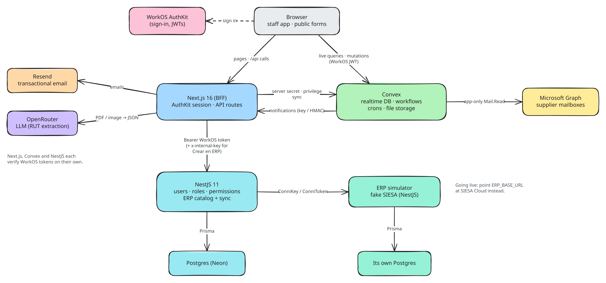
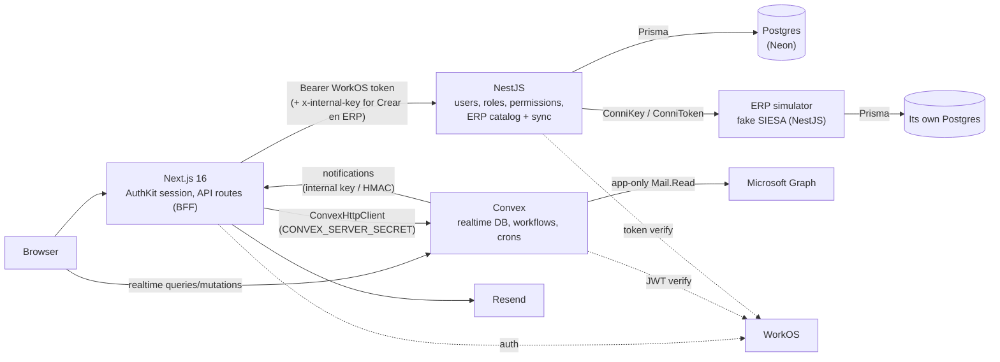

# Lab Trxckin

An internal finance operations platform for multicompany operation: it ingests supplier e-invoices straight from Microsoft 365 mailboxes, routes them through a multi-step approval workflow with SLA tracking, and hands them to accounting for causation. It also runs the employee advances (*anticipos*) and petty cash (*cajas menores*) processes. Built as a pnpm/Turborepo monorepo with Next.js, Convex, NestJS and Postgres.

> All companies, NITs and emails in this repo are fictional demo data.

**Features**

- **Invoice inbox** — scheduled Microsoft Graph sync (every 2 min) reads DIAN `AttachedDocument` e-invoices from a reception mailbox per company, parses the UBL XML, stores XML/PDF and dedupes; manual XML upload as fallback.
- **DIAN validation** — reconcile the DIAN export (XLSX) against ingested invoices.
- **Approval workflow** — tasks assigned per process/owner, returns and rejections, credit-note linking, business-hours SLA tracking (Colombian holidays) and a daily SLA email digest.
- **Accounting causation** — causation step with cost-center distribution and internal-document cross-checks.
- **Advances (*anticipos*)** — request → direct-manager approval → accounting review → management approval → treasury disbursement → legalization, with adjustments and email notifications.
- **Petty cash (*cajas menores*)** — cash boxes, movements and reimbursements that flow into the invoice workflow.
- **Supplier onboarding** — risk-matrix intake (optional AI RUT extraction), public form with autosave and e-signature, Cumplimiento/Compras document review, Compras evaluation, accounting creation, PDF/Excel reports and tracked invitation emails (see [docs/onboarding.md](docs/onboarding.md)).
- **Customer onboarding** — the same pipeline for customers with commercial payment terms, a single Cumplimiento lane and tiered approval.
- **ERP catalog (simulated SIESA)** — a local clientes/proveedores catalog synced from the ERP (daily, on demand, CLI) decides *inscripción* vs *actualización*, blocks duplicate onboarding processes and feeds supplier lookups; a separate fake-SIESA app with its own database stands in for the real ERP (see [docs/erp.md](docs/erp.md)).
- **Role/permission-based access per route** — roles and route permissions live in Postgres; nav and pages are filtered by them.
- **Multi-company** — users are scoped to one or more companies, with an active-company switcher.
- **Admin impersonation** — admins can act as another user (signed cookie, visible banner).
- **Email notifications** via Resend (React Email templates).
- **Command palette** — Ctrl/Cmd+K: navigation, company and theme switching, and live search across invoices, advances, onboarding and cost centers.

## Modules

Each module has a guide with its context, operational and technical diagrams, a code map with links to the source, tests and known limitations.

| Module | What it covers |
| --- | --- |
| [Billing](docs/billing.md) | Supplier e-invoices from the Microsoft 365 mailbox to payment: ingestion, approval workflow, SLA, dashboard |
| [Finance](docs/finance.md) | Employee advances with legalization, and petty cash with its reimbursement chain |
| [Suppliers](docs/suppliers.md) | Risk-based supplier onboarding: public form, e-signature, parallel review, tiered approval, purchasing rubric |
| [Customers](docs/customers.md) | Customer onboarding with payment terms and tiered approval |
| [ERP catalog](docs/erp.md) | Clientes/proveedores synced from the (simulated) SIESA ERP, existence checks, "Crear en ERP" |

Shared onboarding foundation: [docs/onboarding.md](docs/onboarding.md). Mailbox setup: [docs/billing-azure-setup.md](docs/billing-azure-setup.md).

## Architecture

<picture>
  <source media="(prefers-color-scheme: dark)" srcset="docs/diagrams/architecture.dark.svg">
  
</picture>

The diagrams are Excalidraw files: the `.excalidraw` sources in [`docs/diagrams`](docs/diagrams) open in [excalidraw.com](https://excalidraw.com).

<details>
<summary>Mermaid version</summary>



</details>

**Why the split?**

- **Convex** holds the workflow data (invoices, tasks, advances, petty cash). Every screen is a live subscription, workflow steps are transactional mutations, and crons/actions handle mailbox ingestion, SLA digests and dashboard reconciliation without extra infrastructure.
- **NestJS + Postgres** own identity and RBAC (users, roles, route permissions, processes, companies) and the ERP catalog of clientes and proveedores. This data is relational, changes rarely and is shared with other systems, so it stays in a conventional SQL service. The catalog is a replica of the ERP (SIESA), refreshed by a sync; locally a separate fake-SIESA app plays the ERP ([docs/erp.md](docs/erp.md)).
- **Next.js** is the BFF: it holds the WorkOS session, proxies to Nest, and syncs each user's privileges into Convex (`POST /api/me` → `users.syncPrivileges`, guarded by the server secret) so Convex functions can authorize without calling Nest.

## Tech stack

| Layer | Tools |
| --- | --- |
| Frontend | Next.js 16 (App Router), React 19, Tailwind CSS 4, Radix UI, TanStack Query, react-hook-form + zod, Recharts, React PDF, pdf.js, SheetJS/ExcelJS |
| Realtime backend | Convex (+ `@convex-dev/aggregate`), `@azure/identity` for Graph, `fast-xml-parser` |
| API | NestJS 11, Prisma 7 (`@prisma/adapter-pg`), class-validator, Helmet, Swagger |
| Data | Convex, Postgres (Neon) |
| Auth | WorkOS AuthKit |
| Email | Resend + React Email |
| Tooling | pnpm 10, Turborepo, TypeScript 5.9, ESLint 9, Vitest, convex-test |

## Prerequisites

- **Node.js 20.9+** (22 LTS recommended; required by Next.js 16)
- **pnpm 10** — `corepack enable` picks up the version pinned in `package.json`
- Accounts:
  - [WorkOS](https://workos.com) (AuthKit)
  - [Convex](https://convex.dev)
  - [Neon](https://neon.tech) or any Postgres 14+
  - [Resend](https://resend.com) — optional, for email
  - Azure / Entra ID app registration — optional, for mailbox ingestion ([setup guide](docs/billing-azure-setup.md))

## Getting started

**1. Clone and install**

```bash
git clone https://github.com/sxntixgxs/lab-trxckin.git
cd lab-trxckin
corepack enable
pnpm install
```

**2. Copy the env files**

```bash
cp apps/frontend/.env.local.example apps/frontend/.env.local
cp apps/backend/.env.example apps/backend/.env
cp apps/erp-simulator/.env.example apps/erp-simulator/.env
```

Generate every secret with:

```bash
openssl rand -hex 32
```

**3. WorkOS**

In the WorkOS dashboard (or let `convex dev` auto-provision AuthKit, see `apps/frontend/convex.json`):

- Add the redirect URI `http://localhost:3000/callback` and homepage `http://localhost:3000`.
- Enable sign-up (email/password or your SSO provider) under AuthKit settings.
- Copy the Client ID and API key into both `apps/frontend/.env.local` and `apps/backend/.env`, and set `WORKOS_COOKIE_PASSWORD` (32+ chars) in the frontend.

**4. Convex (first run)**

```bash
pnpm --filter frontend exec convex dev
```

This logs you in, creates a dev deployment and writes `CONVEX_DEPLOYMENT`, `NEXT_PUBLIC_CONVEX_URL` and `NEXT_PUBLIC_CONVEX_SITE_URL` into `apps/frontend/.env.local`. Stop it once functions are pushed.

**5. Convex environment variables**

Run from `apps/frontend` (full list in [`convex/.env.convex.example`](apps/frontend/convex/.env.convex.example)):

```bash
cd apps/frontend
npx convex env set WORKOS_CLIENT_ID "client_..."
npx convex env set CONVEX_SERVER_SECRET "<same value as in .env.local>"
npx convex env set NOTIFICATIONS_INTERNAL_KEY "<same value as in .env.local>"
npx convex env set FACTURACION_SLA_DIGEST_SECRET "<same value as in .env.local>"
npx convex env set FRONTEND_URL "http://localhost:3000"
npx convex env set DEFAULT_CONTACT_EMAIL "no-email@example.com"
npx convex env set FACTURACION_GRAPH_MAILBOXES "ops@example.com"
cd ../..
```

Microsoft Graph (`MS_*`, `MS_SECONDARY_*`) and `ENABLE_BACKGROUND_JOBS` are optional; see [docs/billing-azure-setup.md](docs/billing-azure-setup.md).

**6. Postgres: migrate and seed**

Set `DATABASE_URL` (and optionally `DIRECT_URL`) in `apps/backend/.env`, then:

```bash
pnpm --filter backend prisma:migrate
```

```bash
pnpm --filter backend prisma:seed
```

The seed creates the `admin` and `member` roles and their route permissions.

**7. ERP simulator (fake SIESA)**

Create a second database in your Neon project (e.g. `erp_sim`) and set `ERP_SIM_DATABASE_URL`, `ERP_SIM_DIRECT_URL`, `ERP_SIM_CONNI_KEY` and `ERP_SIM_CONNI_TOKEN` in `apps/erp-simulator/.env`; set `ERP_BASE_URL=http://localhost:8100` and the same key/token as `ERP_CONNI_KEY`/`ERP_CONNI_TOKEN` in `apps/backend/.env`. For the "Crear en ERP" button, copy the backend's `NEST_INTERNAL_KEY` into `apps/frontend/.env.local`. Then:

```bash
pnpm --filter erp-simulator prisma:migrate
```

```bash
pnpm --filter erp-simulator prisma:seed
```

After step 8 starts everything, load the catalog once (it then syncs daily; see [docs/erp.md](docs/erp.md)):

```bash
pnpm --filter backend erp:sync
```

**8. Run everything**

```bash
pnpm dev
```

This starts Nest (watch), Next.js, `convex dev` and the ERP simulator side by side.

| Service | URL |
| --- | --- |
| Frontend | http://localhost:3000 |
| Nest API | http://localhost:8000/api/v1 (health: `/health`) |
| Swagger | http://localhost:8000/api (when `NODE_ENV != production` or `ENABLE_SWAGGER=true`) |
| ERP simulator | http://localhost:8100 (Swagger: `/docs`) |

**9. Make yourself admin**

Sign in once at http://localhost:3000 (new users are created with the `member` role), then:

```bash
pnpm --filter backend promote-admin you@example.com
```

Sign out and back in to refresh your privileges.

## Environment variables

Generate secrets with `openssl rand -hex 32`. Secrets marked **shared** must be identical in every place they appear.

### Next.js — `apps/frontend/.env.local`

| Name | Required | Description | Where to get it |
| --- | --- | --- | --- |
| `WORKOS_CLIENT_ID` | yes | AuthKit client id | WorkOS dashboard |
| `WORKOS_API_KEY` | yes | AuthKit API key | WorkOS dashboard |
| `WORKOS_COOKIE_PASSWORD` | yes | Session cookie encryption (32+ chars) | Generate |
| `NEXT_PUBLIC_WORKOS_REDIRECT_URI` | yes | `http://localhost:3000/callback` in dev | Must match WorkOS |
| `CONVEX_DEPLOYMENT` | yes | Target deployment for the Convex CLI | Written by `convex dev` |
| `NEXT_PUBLIC_CONVEX_URL` | yes | Convex client URL | Written by `convex dev` |
| `NEXT_PUBLIC_CONVEX_SITE_URL` | no | Convex HTTP actions URL | Written by `convex dev` |
| `CONVEX_SERVER_SECRET` | yes | **Shared** with Convex; guards server-to-server Convex calls | Generate |
| `IMPERSONATE_COOKIE_SECRET` | yes | HMAC key for the impersonation cookie (dedicated) | Generate |
| `BACKEND_URL` | prod | Nest base URL (defaults to `http://localhost:8000` in dev) | Your deployment |
| `NEST_INTERNAL_KEY` | for "Crear en ERP" | **Shared** with Nest; `x-internal-key` of `/api/erp/terceros` (server-only) | Same as Nest |
| `NEXT_PUBLIC_APP_URL` | no | Public URL used in email links (default `http://localhost:3000`) | Your deployment |
| `NOTIFICATIONS_INTERNAL_KEY` | for email | **Shared** with Convex; `x-notifications-key` header | Generate |
| `FACTURACION_SLA_DIGEST_SECRET` | for email | **Shared** with Convex; HMAC for SLA digest / sync alerts | Generate |
| `RESEND_API_KEY` | no | Without it, notification routes skip sending | Resend dashboard |
| `RESEND_FROM_EMAIL` | no | Sender, e.g. `Notifications <notifications@example.com>` | Verified Resend domain |
| `RESEND_WEBHOOK_SECRET` | no | Verifies Resend delivery webhooks for onboarding emails (`/api/webhooks/resend/onboarding`) | Resend dashboard (Svix secret) |
| `OPENROUTER_API_KEY` | no | AI extraction of the RUT when starting an onboarding process; without it the form is filled manually | OpenRouter |
| `VERCEL_ENV`, `VERCEL_BRANCH_URL`, `VERCEL_PROJECT_PRODUCTION_URL` | no | Redirect URI on Vercel previews/prod | Set by Vercel |

### Convex deployment — `npx convex env set`

| Name | Required | Description | Where to get it |
| --- | --- | --- | --- |
| `WORKOS_CLIENT_ID` | yes | Verifies WorkOS JWTs (`convex/auth.config.ts`) | WorkOS dashboard |
| `CONVEX_SERVER_SECRET` | yes | **Shared** with Next | Same as Next |
| `NOTIFICATIONS_INTERNAL_KEY` | for email | **Shared** with Next | Same as Next |
| `FACTURACION_SLA_DIGEST_SECRET` | for email | **Shared** with Next; signs digest/alert requests | Same as Next |
| `FACTURACION_SLA_DIGEST_DRY_RUN` | no | `true` builds the digest without sending | — |
| `FRONTEND_URL` | yes | Next URL Convex calls for notifications (default `http://localhost:3000`) | Your deployment / tunnel |
| `ENABLE_BACKGROUND_JOBS` | no | `true` lets crons do work (usually prod only) | — |
| `DEFAULT_CONTACT_EMAIL` | no | Fallback email for actors without one | Any placeholder |
| `FACTURACION_GRAPH_MAILBOXES` | no | Comma-separated recipients of ingest alerts | Your team |
| `MS_TENANT_ID`, `MS_CLIENT_ID`, `MS_CLIENT_SECRET` | for ingest | Graph app for the default tenant (companies 1, 3, 4) | Entra ID app registration |
| `MS_SECONDARY_TENANT_ID`, `MS_SECONDARY_CLIENT_ID`, `MS_SECONDARY_CLIENT_SECRET` | for ingest | Graph app for the secondary tenant (company 2) | Entra ID app registration |

### NestJS — `apps/backend/.env`

| Name | Required | Description | Where to get it |
| --- | --- | --- | --- |
| `DATABASE_URL` | yes | Pooled Postgres connection string | Neon dashboard |
| `DIRECT_URL` | no | Direct connection for Prisma migrations | Neon dashboard |
| `WORKOS_CLIENT_ID` | yes | Access token verification | WorkOS dashboard |
| `WORKOS_API_KEY` | yes | User lookups, `promote-admin` | WorkOS dashboard |
| `NEST_INTERNAL_KEY` | yes | **Shared** with Next; guards server-to-server routes | Generate |
| `ERP_BASE_URL` | for the ERP | ERP base URL: the simulator (`http://localhost:8100`) or `https://servicios.siesacloud.com` | — |
| `ERP_CONNI_KEY`, `ERP_CONNI_TOKEN` | for the ERP | SIESA credentials; **shared** with the simulator's `ERP_SIM_CONNI_*` | Generate / SIESA |
| `ERP_INSTANCIA_1_ID_COMPANIA`, `ERP_INSTANCIA_2_ID_COMPANIA` | no | SIESA instance ids (default `5001`, `5002`, the simulator's) | SIESA |
| `ERP_SYNC_PROGRAMADA`, `ERP_SYNC_CRON`, `ERP_SYNC_TZ` | no | Daily catalog sync (default on, `0 0 2 * * *`, `America/Bogota`) | — |
| `ERP_TIMEOUT_MS`, `ERP_TAM_PAGINA` | no | ERP request timeout (30000) and page size (500) | — |
| `FRONTEND_URL` | no | CORS origin (default `http://localhost:3000`) | — |
| `BACKEND_PORT` | no | HTTP port (default `8000`) | — |
| `NODE_ENV` | no | `production` disables Swagger | — |
| `ENABLE_SWAGGER` | no | `true` forces Swagger in production | — |

The backend fails fast at boot if any required variable is missing (`src/config/env.ts`). Without the `ERP_*` connection the catalog stays readable, but nothing syncs.

### ERP simulator — `apps/erp-simulator/.env`

| Name | Required | Description | Where to get it |
| --- | --- | --- | --- |
| `ERP_SIM_DATABASE_URL` | yes | Pooled connection to its **own** database (never the app's) | Neon dashboard |
| `ERP_SIM_DIRECT_URL` | no | Direct connection for its migrations and seed | Neon dashboard |
| `ERP_SIM_CONNI_KEY`, `ERP_SIM_CONNI_TOKEN` | yes | `ConniKey` / `ConniToken` it accepts; **shared** with Nest's `ERP_CONNI_*` | Generate |
| `ERP_SIM_PORT` | no | HTTP port (default `8100`) | — |
| `NODE_ENV`, `ENABLE_SWAGGER` | no | Swagger (`/docs`) outside production | — |

## Scripts

Run from the repo root.

| Command | What it does |
| --- | --- |
| `pnpm dev` | Nest (watch) + Next.js + `convex dev` + ERP simulator via `concurrently` |
| `pnpm build` | `turbo run build` (Nest build, `tsc` + `next build`) |
| `pnpm lint` | ESLint in every app |
| `pnpm typecheck` | `tsc --noEmit` (frontend, `convex/`, backend, backend scripts) |
| `pnpm test` | Vitest in every app |
| `pnpm --filter backend prisma:migrate` | `prisma migrate dev` |
| `pnpm --filter backend prisma:seed` | Seed roles and route permissions |
| `pnpm --filter backend promote-admin <email>` | Give an existing WorkOS user the `admin` role |
| `pnpm --filter backend erp:sync [--empresa N] [--entidad proveedores\|clientes]` | Sync the ERP catalog now |
| `pnpm --filter erp-simulator prisma:migrate` / `prisma:seed [--reset]` | Create / load the fake SIESA database |
| `pnpm --filter frontend convex` | `convex dev` alone |

## Project structure

```
apps/
  frontend/                 Next.js app + Convex functions
    app/(default)/          Authenticated pages: billing/, finance/, suppliers/, customers/, administracion/, dashboard/, perfil/
    app/(public)/           Token-guarded public pages: onboarding/supplier, onboarding/customer (+ /sign)
    app/api/                BFF routes: me, billing, finance, notifications, webhooks, extract-rut, auth/impersonate, ...
    components/             UI (Radix-based) and feature components
    convex/                 Schema, queries/mutations/actions, crons, lib/ (auth, Graph, SLA, ...)
    lib/                    nav.ts, empresas.ts, fetch-backend.ts, impersonation, env helpers, onboarding/ (risk, documents, phases)
    store/                  empresa-store.ts (active company: zustand + localStorage + cookie)
    proxy.ts                AuthKit middleware (public paths, redirect URI)
  backend/                  NestJS API
    src/                    auth/, usuarios/, roles/, permisos-roles/, procesos/, terceros/ (ERP catalog reads), erp/ (SIESA client, sync, scheduler), health/
    prisma/                 schema.prisma, migrations/, seed.ts
    scripts/                promote-admin.ts, erp-sync.ts
  erp-simulator/            Fake SIESA (NestJS) with its own Postgres: standard queries, import connector, seed data
docs/                       module guides (billing, finance, suppliers, customers, erp), onboarding.md, billing-azure-setup.md
  diagrams/                 Excalidraw sources (.excalidraw) and light/dark SVG exports
```

**Naming convention.** Infrastructure and URL segments are in English (`billing`, `finance`, `inbox`, `advances`). Business-domain terms stay in Spanish because the domain is Colombian accounting and the terms have no exact English equivalent: *factura*, *anticipo*, *caja menor*, *causación*, NIT, DIAN. Older admin routes (`administracion`, `perfil`) are still in Spanish.

## Testing and quality

```bash
pnpm typecheck
```

```bash
pnpm lint
```

```bash
pnpm test
```

- **Frontend**: Vitest with two projects — `convex` (Convex functions tested with `convex-test` in the edge runtime, including the end-to-end onboarding flows) and `app` (Node: API route auth, impersonation, parsers, onboarding payload/webhook validation, risk matrices and report builders).
- **Backend**: Vitest specs for guards, impersonation, env validation and the ERP integration (client paging/retries, row mapping, sync diff, import document, NIT check digits).
- **ERP simulator**: Vitest specs for the SIESA filter grammar, pagination, row projection, import validation and the deterministic data generator.
- Optional fixture: set `DIAN_XLSX_FIXTURE` to a real DIAN export to run the extra XLSX parser test.

## Adding a module

1. Add a nav item with a `permission` in `apps/frontend/lib/nav.ts`.
2. Create `apps/frontend/app/(default)/<module>/page.tsx` wrapped in `ProtectedPage` (`components/utils/ProtectedPage.tsx`).
3. Add the route to `ALLOWED_RUTAS` in `apps/backend/src/permisos-roles/rutas-catalogo.ts`, re-run the seed (admin gets every route), and grant it to other roles from **Administración → Accesos**.

## Security notes and known limitations

This is a portfolio project extracted from a real internal tool. The Convex deployment URL ships in the frontend bundle, so any signed-in user can call any public query or mutation with arbitrary arguments: every public Convex function authorizes on the server, and page-level route permissions are only UX.

**How authorization works**

- **Actor from the identity, never from args.** `requireActor` (`convex/lib/billingAuth.ts`) loads the caller's synced `users` row. The `mutationConActor` / `queryConActor` / `mutationConActorIds` / `queryConActorIds` wrappers (`convex/lib/serverActor.ts`) overwrite client-sent `actorUserId`/`actorNombre`/`actorEmail`/`actorRol` and "whose data" ids (`asignadoAUserId`, `userId`, `createdById`, ...) with the caller's values. Functions that take `secret` are server-to-server (Next routes via `ConvexHttpClient`) and check `CONVEX_SERVER_SECRET`; when they act for a user, the route passes the session-derived actor.
- **Route permission + company.** `requirePermisoEmpresa` and `actorPuedeVerEmpresa` apply the same route permissions as the pages (`lib/rutas-sistema.ts`) plus the user's companies.
- **Workflow ownership.** Invoice workflow mutations act only on the caller's pending assignment (or full access); advances on the owner of the current phase or the configured role; petty cash on the custodian / configured reviewer.
- **Record-scoped reads.** An invoice is readable with the invoices permission in its company, by anyone who took part in its workflow, or from the petty cash screens when it is a petty cash invoice (`convex/lib/facturacionAccess.ts`). Advances follow the lists' visibility (requester, legalization responsible, current phase owner, company role holders). Unauthorized reads return `null`/`[]` rather than throwing.
- **Files.** `facturacionStorage.getUrl`/`getUrls` only sign storage ids that belong to an invoice or onboarding inscription the caller can read (`convex/lib/storageAccess.ts`); Convex storage has no owner, so callers name the record.

**Closed in the latest hardening pass** (covered by `convex/*Autorizacion.test.ts`, `convex/onboardingSeguridad.test.ts` and the petty cash workflow tests):

- **Billing settings**: role lists, reception mailbox and the supplier-analyst table need `billing/settings` in the target company; audit fields come from the identity.
- **Invoice workflow** (`convex/facturacionTareas.ts`): actor args are identity-derived and each mutation verifies the caller owns the assignment. The task-level actions of the invoice detail panel only run for tasks without assignments (as the UI shows them), and the inbox queries always return the caller's own inbox.
- **Invoice attachments**: added or deleted only by someone working the invoice (or the uploader); lists are scoped like invoice reads.
- **Read queries**: emails, invoice detail and detail sections, DIAN CUFE lookup, tasks, invoice list/export; advance detail, phases, draft supports and role config; petty cash role config, company config, configured-staff lists and a user's assigned funds.
- **Advances**: return, reject and annul require the owner of the current phase. Rejection is only possible in review, never after disbursement. A disbursed advance can only be annulled by Gerencia or Tesorería, which voids its invoice crosses and recomputes what those invoices owe; annulment is refused if a crossed invoice already closed. Only Tesorería manages disbursement supports, which never delete files outside the advance. Creating an advance requires `finance/advances/request`, and `/finance/advances/request` is gated by it. Changing roles (`POST /api/finance/advances/configuracion/roles`) requires an administrator or the company's GERENCIA, checked in Convex.
- **Petty cash**: the custodian check behind marking or legalizing an invoice with petty cash uses the authenticated caller, and failed-upload cleanup only deletes freshly uploaded files.
- **Onboarding**: the Compras score is recomputed on the server from the raw criteria. "Copiar enlace" rotates the previous links of that step (and rotation no longer misses recent tokens when many revoked ones accumulate). Public uploads and the legal representative's signature re-check the document pair; the sign page now asks for it.
- **RUT extraction** (`/api/extract-rut`) receives the uploaded file instead of resolving an arbitrary storage id.
- **Consistency**: `devolverMovimientoABuzon` and the causación recount now write through the petty cash bandeja helpers. Before, they left `disponibleEnBandeja` and the pending-movements aggregate stale, and the recount made the next reimbursement update fail with `DELETE_MISSING_KEY`.

**Known limitations**

- **`/api/convex/storage/[id]`** (the Next proxy behind advance, petty cash and PDF links) still serves any storage id to any signed-in user. It needs the same record scoping as `getUrl`, for example by calling Convex with the user's token and a record context.
- **Storage ids are not owned.** Mutations that attach a file (invoice attachments, public onboarding documents, advance supports) only check that the id exists, so a caller who learns another file's id could attach it to a record they control.
- **Onboarding second factor.** `obtenerInscripcionPublica` returns the registered document number to whoever holds the link, so the document re-check is a speed bump rather than a real second factor.
- **Client-supplied display fields.** A few mutations still store names/emails sent by the client next to verified ids (e.g. the custodian and leader-approval fields of `generarReembolsoCajaMenor`).
- **Legacy data.** Advances rejected after disbursement before this pass may still hold active invoice crosses, and reimbursements whose aggregate key drifted before the fix need an aggregate repair.
- **Admin maintenance mutations** such as `limpiarDatosAnticipos` are destructive by design; demo accounts should not have full access.
- **No rate limiting** on the NestJS API.
- **Convex → local services.** Convex runs in the cloud, so a `FRONTEND_URL` pointing at `localhost` will not be reachable from a cloud dev deployment; use a tunnel to test notifications locally. (Convex no longer calls Nest: every ERP call goes through the Next BFF.)

Also in place: `/api/notifications/*` only accept the internal key or an HMAC signature with a 5-minute window; Nest verifies WorkOS tokens, checks route permissions and company scope on the ERP catalog routes, and guards internal routes with `NEST_INTERNAL_KEY`; user privileges reach Convex only through `POST /api/me` → `users.syncPrivileges`; impersonation uses a dedicated signed cookie; public onboarding links carry random per-inscription tokens (hashed at rest, scoped, rotated on resend and on "Copiar enlace", revoked on annulment); Resend webhooks are verified with the Svix signature; Helmet, strict DTO validation and fail-fast env checks on Nest.

## My role

I designed and built Lab Trxckin on my own: the data model, the Convex workflows and crons, the NestJS identity service, the Next.js app and BFF routes, the Microsoft Graph and Resend integrations, the tests and the CI pipeline.

## What I learned

- **Put each kind of data where it fits.** Live, transactional workflow data in Convex; relational, rarely changing identity and permissions in Postgres; a thin BFF that keeps the session and syncs privileges between them.
- **Make processes explicit.** Every module is a state machine with named phases, a current owner and an append-only history, so the system can always answer who acts next, which transitions are valid and how each decision was recorded.
- **Idempotency and reconciliation beat hoping jobs run once.** Keys on emails, invoices and adjustments make retries safe, and periodic reconciliation repairs read models instead of trusting them blindly.
- **Write down the gaps.** The known limitations above are the hardening backlog, not an afterthought.

## License

[MIT](LICENSE) © Santiago Sandoval
