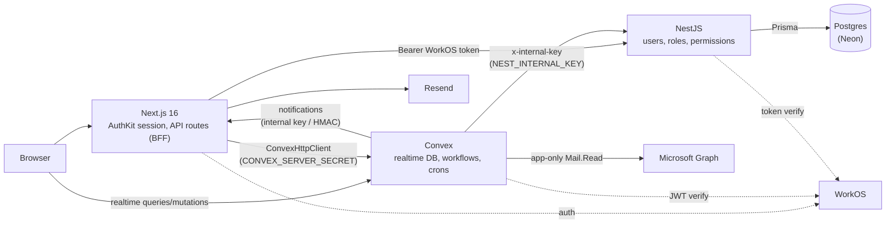

# Lab Trxckin

An internal finance operations platform for multicompany operation: it ingests supplier e-invoices straight from Microsoft 365 mailboxes, routes them through a multi-step approval workflow with SLA tracking, and hands them to accounting for causation. It also runs the employee advances (*anticipos*) and petty cash (*cajas menores*) processes. Built as a pnpm/Turborepo monorepo with Next.js, Convex, NestJS and Postgres.

> All companies, NITs and emails in this repo are fictional demo data.

**Features**

- **Invoice inbox** — scheduled Microsoft Graph sync (every 2 min) reads DIAN `AttachedDocument` e-invoices from a reception mailbox per company, parses the UBL XML, stores XML/PDF and dedupes; manual XML upload as fallback.
- **DIAN validation** — reconcile the DIAN export (XLSX) against ingested invoices.
- **Approval workflow** — tasks assigned per process/owner, returns and rejections, credit-note linking, business-hours SLA tracking (Colombian holidays) and a daily SLA email digest.
- **Accounting causation** — causation step with cost-center distribution and internal-document cross-checks.
- **Advances (*anticipos*)** — request → direct-manager approval → accounting review → management approval → treasury disbursement → legalization, with adjustments and email notifications.
- **Petty cash (*cajas menores*)** — cash boxes, movements and reimbursements that flow into the invoice workflow.
- **Role/permission-based access per route** — roles and route permissions live in Postgres; nav and pages are filtered by them.
- **Multi-company** — users are scoped to one or more companies, with an active-company switcher.
- **Admin impersonation** — admins can act as another user (signed cookie, visible banner).
- **Email notifications** via Resend (React Email templates).

## Architecture



**Why the split?**

- **Convex** holds the workflow data (invoices, tasks, advances, petty cash). Every screen is a live subscription, workflow steps are transactional mutations, and crons/actions handle mailbox ingestion, SLA digests and dashboard reconciliation without extra infrastructure.
- **NestJS + Postgres** own identity and RBAC (users, roles, route permissions, processes, companies, suppliers). This data is relational, changes rarely and is shared with other systems, so it stays in a conventional SQL service.
- **Next.js** is the BFF: it holds the WorkOS session, proxies to Nest, and syncs each user's privileges into Convex (`POST /api/me` → `users.syncPrivileges`, guarded by the server secret) so Convex functions can authorize without calling Nest.

## Tech stack

| Layer | Tools |
| --- | --- |
| Frontend | Next.js 16 (App Router), React 19, Tailwind CSS 4, Radix UI, TanStack Query, Recharts, React PDF, pdf.js |
| Realtime backend | Convex (+ `@convex-dev/aggregate`), `@azure/identity` for Graph, `fast-xml-parser` |
| API | NestJS 11, Prisma 7 (`@prisma/adapter-pg`), class-validator, Helmet, Swagger |
| Data | Convex, Postgres (Neon) |
| Auth | WorkOS AuthKit |
| Email | Resend + React Email |
| Tooling | pnpm 10, Turborepo, TypeScript 5.9, ESLint 9, Vitest, convex-test |

## Prerequisites

- **Node.js 20.9+** (22 LTS recommended; required by Next.js 16)
- **pnpm 10** — `corepack enable` picks up the version pinned in `package.json`
- Accounts:
  - [WorkOS](https://workos.com) (AuthKit)
  - [Convex](https://convex.dev)
  - [Neon](https://neon.tech) or any Postgres 14+
  - [Resend](https://resend.com) — optional, for email
  - Azure / Entra ID app registration — optional, for mailbox ingestion ([setup guide](docs/billing-azure-setup.md))

## Getting started

**1. Clone and install**

```bash
git clone https://github.com/sxntixgxs/lab-trxckin.git
cd lab-trxckin
corepack enable
pnpm install
```

**2. Copy the env files**

```bash
cp apps/frontend/.env.local.example apps/frontend/.env.local
cp apps/backend/.env.example apps/backend/.env
```

Generate every secret with:

```bash
openssl rand -hex 32
```

**3. WorkOS**

In the WorkOS dashboard (or let `convex dev` auto-provision AuthKit, see `apps/frontend/convex.json`):

- Add the redirect URI `http://localhost:3000/callback` and homepage `http://localhost:3000`.
- Enable sign-up (email/password or your SSO provider) under AuthKit settings.
- Copy the Client ID and API key into both `apps/frontend/.env.local` and `apps/backend/.env`, and set `WORKOS_COOKIE_PASSWORD` (32+ chars) in the frontend.

**4. Convex (first run)**

```bash
pnpm --filter frontend exec convex dev
```

This logs you in, creates a dev deployment and writes `CONVEX_DEPLOYMENT`, `NEXT_PUBLIC_CONVEX_URL` and `NEXT_PUBLIC_CONVEX_SITE_URL` into `apps/frontend/.env.local`. Stop it once functions are pushed.

**5. Convex environment variables**

Run from `apps/frontend` (full list in [`convex/.env.convex.example`](apps/frontend/convex/.env.convex.example)):

```bash
cd apps/frontend
npx convex env set WORKOS_CLIENT_ID "client_..."
npx convex env set CONVEX_SERVER_SECRET "<same value as in .env.local>"
npx convex env set NOTIFICATIONS_INTERNAL_KEY "<same value as in .env.local>"
npx convex env set FACTURACION_SLA_DIGEST_SECRET "<same value as in .env.local>"
npx convex env set NEST_INTERNAL_KEY "<same value as in apps/backend/.env>"
npx convex env set FRONTEND_URL "http://localhost:3000"
npx convex env set BACKEND_URL "http://localhost:8000"
npx convex env set DEFAULT_CONTACT_EMAIL "no-email@example.com"
npx convex env set FACTURACION_GRAPH_MAILBOXES "ops@example.com"
cd ../..
```

Microsoft Graph (`MS_*`, `MS_SECONDARY_*`) and `ENABLE_BACKGROUND_JOBS` are optional; see [docs/billing-azure-setup.md](docs/billing-azure-setup.md).

**6. Postgres: migrate and seed**

Set `DATABASE_URL` (and optionally `DIRECT_URL`) in `apps/backend/.env`, then:

```bash
pnpm --filter backend prisma:migrate
```

```bash
pnpm --filter backend prisma:seed
```

The seed creates the `admin` and `member` roles and their route permissions.

**7. Run everything**

```bash
pnpm dev
```

This starts Nest (watch), Next.js and `convex dev` side by side.

| Service | URL |
| --- | --- |
| Frontend | http://localhost:3000 |
| Nest API | http://localhost:8000/api/v1 (health: `/health`) |
| Swagger | http://localhost:8000/api (when `NODE_ENV != production` or `ENABLE_SWAGGER=true`) |

**8. Make yourself admin**

Sign in once at http://localhost:3000 (new users are created with the `member` role), then:

```bash
pnpm --filter backend promote-admin you@example.com
```

Sign out and back in to refresh your privileges.

## Environment variables

Generate secrets with `openssl rand -hex 32`. Secrets marked **shared** must be identical in every place they appear.

### Next.js — `apps/frontend/.env.local`

| Name | Required | Description | Where to get it |
| --- | --- | --- | --- |
| `WORKOS_CLIENT_ID` | yes | AuthKit client id | WorkOS dashboard |
| `WORKOS_API_KEY` | yes | AuthKit API key | WorkOS dashboard |
| `WORKOS_COOKIE_PASSWORD` | yes | Session cookie encryption (32+ chars) | Generate |
| `NEXT_PUBLIC_WORKOS_REDIRECT_URI` | yes | `http://localhost:3000/callback` in dev | Must match WorkOS |
| `CONVEX_DEPLOYMENT` | yes | Target deployment for the Convex CLI | Written by `convex dev` |
| `NEXT_PUBLIC_CONVEX_URL` | yes | Convex client URL | Written by `convex dev` |
| `NEXT_PUBLIC_CONVEX_SITE_URL` | no | Convex HTTP actions URL | Written by `convex dev` |
| `CONVEX_SERVER_SECRET` | yes | **Shared** with Convex; guards server-to-server Convex calls | Generate |
| `IMPERSONATE_COOKIE_SECRET` | yes | HMAC key for the impersonation cookie (dedicated) | Generate |
| `BACKEND_URL` | prod | Nest base URL (defaults to `http://localhost:8000` in dev) | Your deployment |
| `NEXT_PUBLIC_APP_URL` | no | Public URL used in email links (default `http://localhost:3000`) | Your deployment |
| `NOTIFICATIONS_INTERNAL_KEY` | for email | **Shared** with Convex; `x-notifications-key` header | Generate |
| `FACTURACION_SLA_DIGEST_SECRET` | for email | **Shared** with Convex; HMAC for SLA digest / sync alerts | Generate |
| `RESEND_API_KEY` | no | Without it, notification routes skip sending | Resend dashboard |
| `RESEND_FROM_EMAIL` | no | Sender, e.g. `Notifications <notifications@example.com>` | Verified Resend domain |
| `VERCEL_ENV`, `VERCEL_BRANCH_URL`, `VERCEL_PROJECT_PRODUCTION_URL` | no | Redirect URI on Vercel previews/prod | Set by Vercel |

### Convex deployment — `npx convex env set`

| Name | Required | Description | Where to get it |
| --- | --- | --- | --- |
| `WORKOS_CLIENT_ID` | yes | Verifies WorkOS JWTs (`convex/auth.config.ts`) | WorkOS dashboard |
| `CONVEX_SERVER_SECRET` | yes | **Shared** with Next | Same as Next |
| `NOTIFICATIONS_INTERNAL_KEY` | for email | **Shared** with Next | Same as Next |
| `FACTURACION_SLA_DIGEST_SECRET` | for email | **Shared** with Next; signs digest/alert requests | Same as Next |
| `FACTURACION_SLA_DIGEST_DRY_RUN` | no | `true` builds the digest without sending | — |
| `FRONTEND_URL` | yes | Next URL Convex calls for notifications (default `http://localhost:3000`) | Your deployment / tunnel |
| `BACKEND_URL` | no | Nest URL for supplier upserts (skipped if unset/unreachable) | Your deployment / tunnel |
| `NEST_INTERNAL_KEY` | no | **Shared** with Nest; `x-internal-key` header | Same as Nest |
| `ENABLE_BACKGROUND_JOBS` | no | `true` lets crons do work (usually prod only) | — |
| `DEFAULT_CONTACT_EMAIL` | no | Fallback email for actors without one | Any placeholder |
| `FACTURACION_GRAPH_MAILBOXES` | no | Comma-separated recipients of ingest alerts | Your team |
| `MS_TENANT_ID`, `MS_CLIENT_ID`, `MS_CLIENT_SECRET` | for ingest | Graph app for the default tenant (companies 1, 3, 4) | Entra ID app registration |
| `MS_SECONDARY_TENANT_ID`, `MS_SECONDARY_CLIENT_ID`, `MS_SECONDARY_CLIENT_SECRET` | for ingest | Graph app for the secondary tenant (company 2) | Entra ID app registration |

### NestJS — `apps/backend/.env`

| Name | Required | Description | Where to get it |
| --- | --- | --- | --- |
| `DATABASE_URL` | yes | Pooled Postgres connection string | Neon dashboard |
| `DIRECT_URL` | no | Direct connection for Prisma migrations | Neon dashboard |
| `WORKOS_CLIENT_ID` | yes | Access token verification | WorkOS dashboard |
| `WORKOS_API_KEY` | yes | User lookups, `promote-admin` | WorkOS dashboard |
| `NEST_INTERNAL_KEY` | yes | **Shared** with Convex | Generate |
| `FRONTEND_URL` | no | CORS origin (default `http://localhost:3000`) | — |
| `BACKEND_PORT` | no | HTTP port (default `8000`) | — |
| `NODE_ENV` | no | `production` disables Swagger | — |
| `ENABLE_SWAGGER` | no | `true` forces Swagger in production | — |

The backend fails fast at boot if any required variable is missing (`src/config/env.ts`).

## Scripts

Run from the repo root.

| Command | What it does |
| --- | --- |
| `pnpm dev` | Nest (watch) + Next.js + `convex dev` via `concurrently` |
| `pnpm build` | `turbo run build` (Nest build, `tsc` + `next build`) |
| `pnpm lint` | ESLint in every app |
| `pnpm typecheck` | `tsc --noEmit` (frontend, `convex/`, backend, backend scripts) |
| `pnpm test` | Vitest in every app |
| `pnpm --filter backend prisma:migrate` | `prisma migrate dev` |
| `pnpm --filter backend prisma:seed` | Seed roles and route permissions |
| `pnpm --filter backend promote-admin <email>` | Give an existing WorkOS user the `admin` role |
| `pnpm --filter frontend convex` | `convex dev` alone |

## Project structure

```
apps/
  frontend/                 Next.js app + Convex functions
    app/(default)/          Authenticated pages: billing/, finance/, administracion/, dashboard/, perfil/
    app/api/                BFF routes: me, billing, finance, notifications, auth/impersonate, ...
    components/             UI (Radix-based) and feature components
    convex/                 Schema, queries/mutations/actions, crons, lib/ (auth, Graph, SLA, ...)
    lib/                    nav.ts, empresas.ts, fetch-backend.ts, impersonation, env helpers
    proxy.ts                AuthKit middleware (public paths, redirect URI)
  backend/                  NestJS API
    src/                    auth/, usuarios/, roles/, permisos-roles/, procesos/, proveedores/, health/
    prisma/                 schema.prisma, migrations/, seed.ts
    scripts/                promote-admin.ts
docs/                       billing-azure-setup.md
```

**Naming convention.** Infrastructure and URL segments are in English (`billing`, `finance`, `inbox`, `advances`). Business-domain terms stay in Spanish because the domain is Colombian accounting and the terms have no exact English equivalent: *factura*, *anticipo*, *caja menor*, *causación*, NIT, DIAN. Older admin routes (`administracion`, `perfil`) are still in Spanish.

## Testing and quality

```bash
pnpm typecheck
```

```bash
pnpm lint
```

```bash
pnpm test
```

- **Frontend**: Vitest with two projects — `convex` (Convex functions tested with `convex-test` in the edge runtime) and `app` (Node: API route auth, impersonation, parsers).
- **Backend**: Vitest specs for guards, impersonation and env validation.
- Optional fixture: set `DIAN_XLSX_FIXTURE` to a real DIAN export to run the extra XLSX parser test.

## Adding a module

1. Add a nav item with a `permission` in `apps/frontend/lib/nav.ts`.
2. Create `apps/frontend/app/(default)/<module>/page.tsx` wrapped in `ProtectedPage` (`components/utils/ProtectedPage.tsx`).
3. Add the route to `ALLOWED_RUTAS` in `apps/backend/src/permisos-roles/rutas-catalogo.ts`, re-run the seed (admin gets every route), and grant it to other roles from **Administración → Accesos**.

## Security notes and known limitations

This is a portfolio project extracted from a real internal tool; hardening is ongoing. Known gaps:

- **Client-supplied actor args.** Many workflow mutations in `convex/facturacionTareas.ts` still accept `actorEmail`/`actorUserId`-style arguments from the client. The migration path is `requireActor` (`convex/lib/auth.ts`) or the `mutationConActor`/`queryConActor` wrappers in `convex/lib/serverActor.ts`, which overwrite actor args with identity-derived values (already used by petty cash and advances).
- **Read queries.** Most Convex read queries do not enforce per-user or per-company authorization yet; they rely on page-level route permissions.
- **Advances.** The *devolver*/*rechazar*/*anular* mutations record the real actor but do not check the actor's role for that step.
- **No rate limiting** on the NestJS API.
- **Convex → local services.** Convex runs in the cloud, so `FRONTEND_URL`/`BACKEND_URL` pointing at `localhost` will not be reachable from a cloud dev deployment; use a tunnel to test notifications and supplier upserts locally.

What is in place: server-to-server Convex functions require `CONVEX_SERVER_SECRET` (constant-time compare); `/api/notifications/*` only accept the internal key or an HMAC signature with a 5-minute window; Nest verifies WorkOS tokens and guards internal routes with `NEST_INTERNAL_KEY`; user privileges reach Convex only through `POST /api/me` → `users.syncPrivileges`; impersonation uses a dedicated signed cookie; Helmet, strict DTO validation and fail-fast env checks on Nest.

## License

[MIT](LICENSE) © Santiago Sandoval
