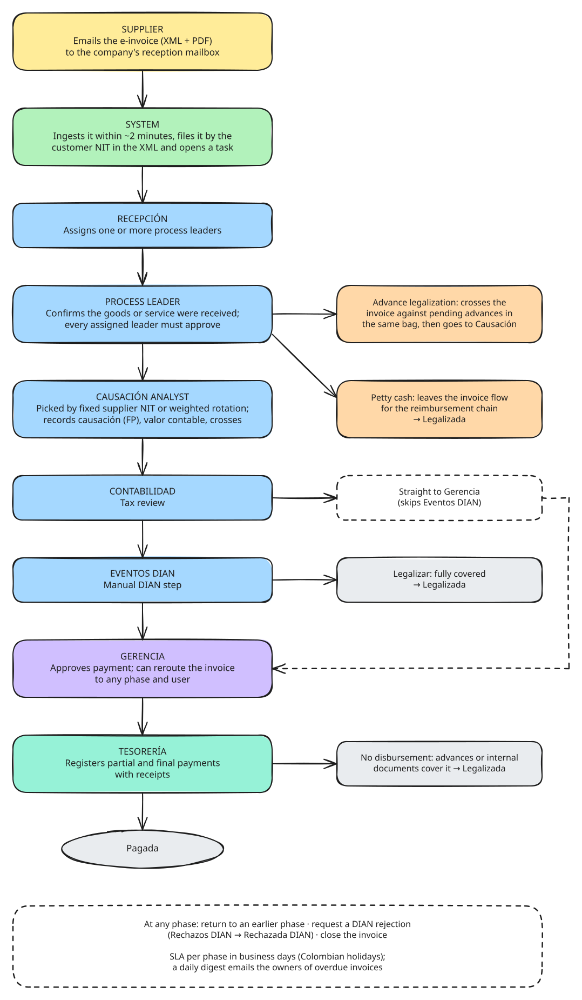
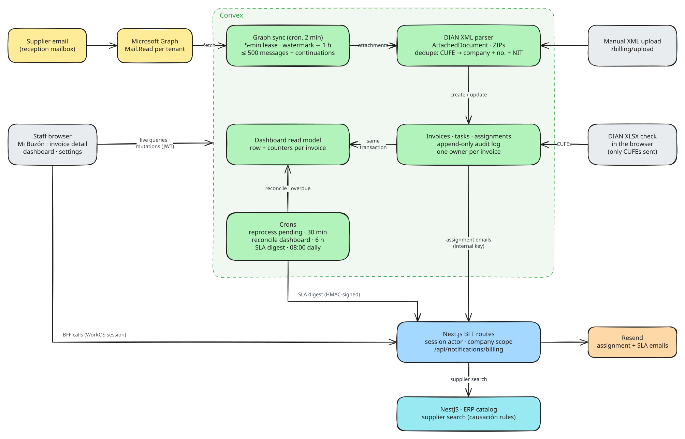

# Billing: supplier e-invoices from mailbox to payment

Module guide for [Lab Trxckin](../README.md). All companies, NITs and emails in this repo are fictional demo data.

<picture>
  <source media="(prefers-color-scheme: dark)" srcset="diagrams/billing-operational.dark.svg">
  
</picture>

## Context

Colombian suppliers send electronic invoices (DIAN *facturas electrónicas*) by email: an `AttachedDocument` XML, usually zipped with a PDF, delivered to each company's reception mailbox. Without a system, every invoice has to be downloaded, matched to the right company, routed by hand for approval, recorded in accounting (*causación*) and followed up until someone pays it, with no shared view of who holds it or how late it is.

The billing module turns that into one traceable workflow: invoices arrive by themselves, each one has exactly one current owner, every decision is audited, and every phase has a business-day SLA.

## My role

I designed and built the module end to end as part of Lab Trxckin: the Convex data model and workflow mutations, the Microsoft Graph ingestion, the Next.js pages and BFF routes, the dashboard read model and the tests.

## Tech and why

| Choice | Why |
| --- | --- |
| **Convex** for invoices, tasks and assignments | Every workflow step is a transactional mutation, and every inbox is a live subscription, so nobody works from a stale list. Crons handle mailbox sync, SLA digests and reconciliation without extra infrastructure. |
| **Microsoft Graph**, app-only `Mail.Read` (one Entra app per tenant) | Reads the reception mailboxes directly, so suppliers keep their usual channel. |
| **fast-xml-parser** inside Convex | Parses DIAN UBL and `AttachedDocument` XML where the data lands. |
| **Next.js BFF routes** for sensitive operations | Returns, causación, internal-document crosses and physical documents take the acting user from the WorkOS session, never from the request body. |
| **Resend + React Email** | Assignment emails and the daily SLA digest. |
| **ExcelJS in the browser** | The DIAN export is reconciled locally; only CUFE codes reach the server. |

## Results and learnings

- Invoices reach the inbox within about two minutes of arriving in the mailbox (the sync cron runs every 2 minutes), and the company is taken from the customer NIT in the XML, not from the mailbox.
- Every transition writes an append-only audit row, so the invoice page can replay the full history: who held it, for how long, and why it moved.
- **Idempotency belongs in the data, not the scheduler.** Emails are keyed by Graph message id and invoices dedupe by CUFE (then by company + number + NIT), so retrying a half-processed email is always safe.
- **A read model updated inside the same transaction keeps dashboards exact and cheap.** A reconciliation cron every 6 hours repairs drift, for example invoices that age into an SLA breach without being touched.
- **SLAs have to be measured in business time.** The holiday calculator implements Colombia's Emiliani rules plus the Easter-based holidays, so it works for any year without a hard-coded list.

## How it works

1. **Supplier:** emails the e-invoice to the reception mailbox configured on `/billing/settings`.
2. **System:** within about two minutes it imports the attachments (ZIPs unpacked one level), parses the XML, files the invoice under the company whose NIT is the customer, stores XML/PDF/supporting documents and opens a task in **Recepción**. Emails it cannot process appear on `/billing/emails` with the reason and a retry button; if Azure is not configured, anyone with access can upload the XML on `/billing/upload`.
3. **Recepción:** assigns one or more **process leaders** from *Mi Buzón*.
4. **Process leader:** confirms the goods or service were received. The invoice moves on once *every* assigned leader has approved. A leader can also mark it as an **advance legalization** (crossed against pending advances in the process's bag) or as **petty cash** (it leaves for the reimbursement flow and ends *Legalizada*), add another leader, or return it.
5. **Causación analyst:** picked automatically by a fixed supplier-NIT rule or weighted rotation. Records causación (FP number), adjusts the *valor contable* and records internal-document crosses, then sends it to Contabilidad. If the same person also holds the next roles, one action skips ahead while still writing auditable placeholder assignments.
6. **Contabilidad:** tax review, then Eventos DIAN or straight to Gerencia.
7. **Eventos DIAN:** a manual DIAN step; forwards to Gerencia or legalizes an invoice that is fully covered.
8. **Gerencia:** approves payment. Can also reroute the invoice to any phase and user.
9. **Tesorería:** records partial payments with receipts until the balance is zero → **Pagada**; or "no disbursement" when advances or internal documents already cover it → **Legalizada**.

At any active phase the current owner can return the invoice to an earlier phase, request a DIAN rejection (handled by *Rechazos DIAN* → **Rechazada DIAN**) or close it. Owners of overdue invoices receive a daily SLA digest; supervisors get the unassigned ones.

## Technical design

<picture>
  <source media="(prefers-color-scheme: dark)" srcset="diagrams/billing-technical.dark.svg">
  
</picture>

### Ingestion

- `facturacion-sincronizar-bandeja` runs every 2 minutes; `facturacion-reprocesar-pendientes` every 30 minutes. Both do nothing unless `ENABLE_BACKGROUND_JOBS=true`.
- Each mailbox has a **5-minute lease**, so the cron and the manual "Sincronizar bandeja" button never overlap.
- The query starts at the stored **watermark minus 1 hour** (or 7 days back for a new mailbox), oldest first, 50 per page. After **500 messages** a run schedules a continuation (at most 10 in a row).
- Graph calls retry 429 and 5xx responses up to 4 times, honoring `Retry-After`.
- The watermark only moves forward, and it freezes if an email fails to save, so no message is skipped.
- An email that fails processing is retried up to **5 times**; unprocessed emails older than 1 hour trigger an HMAC-signed alert, at most once per mailbox every 6 hours.
- One email can create several invoices (one per XML). Unknown customer NITs are skipped rather than guessed.
- Dedupe: first by **CUFE**, then by company + normalized invoice number + supplier NIT. On a match the row is updated, but a *valor contable* edited by a user is kept.
- New suppliers are upserted into NestJS (`x-internal-key`).

### Workflow

One task per invoice, many assignments grouped per phase, and an append-only audit log.

| Phase | Who acts | Main actions |
| --- | --- | --- |
| `recepcion` | Recepción users | Assign leader(s) · close · DIAN rejection |
| `revision_lider` | Assigned leaders | Approve (all must) · mark advance · mark petty cash · add leader · return |
| `causacion` | Analyst (NIT rule or weighted rotation) | Send to Contabilidad · skip ahead · peer handoff · return |
| `revision_impuestos` | Contabilidad | To Eventos DIAN · direct to Gerencia · legalize with petty cash · return |
| `eventos_dian` | Eventos DIAN | To Gerencia · legalize · return |
| `gerencia` | Gerencia | Approve to Tesorería · reroute to any phase and user · return |
| `revision_tesoreria` | Tesorero | Partial payment · confirm paid · confirm without disbursement |
| `pendiente_rechazar_dian` | Rechazos DIAN | Confirm DIAN rejection |
| `reembolso_caja_menor` | Petty-cash chain | Reimbursement paid → `legalizada` |

Final states: `pagada`, `legalizada`, `cerrada`, `rechazada`, `rechazada_dian`, `nota_credito_cerrada`. Every transition closes the previous assignment, resets the phase clock only on a real phase change, refreshes the dashboard row and emails the new owner.

### SLA and the daily digest

Thresholds are whole business days per company and phase, with a warning at 80% (`computeSlaState`). Business time is computed in `America/Bogota` with the Colombian holiday calendar. The digest cron skips non-business days, groups breached invoices by current owner, sends at most 250 invoices per email, and records every send so it never duplicates. `FACTURACION_SLA_DIGEST_DRY_RUN` builds it without sending.

### Dashboard read model

`facturacionDashboardItems` keeps one precomputed row per invoice, and exact counters (per currency, overall and per issue date) are adjusted in the same transaction as each change. Queries never scan raw invoices. A resumable backfill rebuilds everything, and the 6-hour reconciliation catches drift.

### DIAN XLSX validation

`/billing/invoices/validate-dian` opens the DIAN export in the browser, drops "Application response" rows, sends only the unique CUFEs to Convex in batches of 250 and exports a workbook with *Encontradas* and *No encontradas* sheets.

### Security

- Next.js routes call Convex with `CONVEX_SERVER_SECRET` (constant-time compare) and take the actor from the session.
- Convex → Next notifications use `x-notifications-key`; the SLA digest and ingestion alerts are HMAC-SHA256 signed with a 5-minute window.
- Company scope is checked on every BFF route (`api/billing/empresa-scope.ts`).

### Main tables

| Table | Purpose |
| --- | --- |
| `facturacionCorreos`, `facturacionSyncCuentas`, `facturacionSyncRuns` | Captured emails, per-mailbox lease and watermark, run log |
| `facturacionFacturas` | Invoices and credit/debit notes with parsed XML fields and normalized keys |
| `facturacionTareas`, `facturacionAsignaciones`, `facturacionAprobaciones` | Task per invoice, assignments, append-only audit trail |
| `facturacionConfiguracion`, `facturacionConfiguracionUsuarios` | Per-company roles, mailbox and email lists |
| `facturacionDashboardItems`, `facturacionDashboardContadores*`, `facturacionDashboardResponsables` | Read model, exact counters, current owners |
| `facturacionSlaConfiguracion`, `facturacionSlaEmpresaConfig`, `facturacionSlaDigestLog` | SLA thresholds, supervisors, digest de-duplication |

## Code map

**Pages**
- [`billing/page.tsx`](<../apps/frontend/app/(default)/billing/page.tsx>): dashboard
- [`billing/inbox/page.tsx`](<../apps/frontend/app/(default)/billing/inbox/page.tsx>): *Mi Buzón*, the per-user queue
- [`billing/invoices/page.tsx`](<../apps/frontend/app/(default)/billing/invoices/page.tsx>): list, time report, Excel export
- [`billing/invoices/[id]/page.tsx`](<../apps/frontend/app/(default)/billing/invoices/[id]/page.tsx>): invoice detail and audit timeline
- [`billing/invoices/validate-dian/page.tsx`](<../apps/frontend/app/(default)/billing/invoices/validate-dian/page.tsx>): DIAN XLSX reconciliation
- [`billing/emails/page.tsx`](<../apps/frontend/app/(default)/billing/emails/page.tsx>): captured emails with retry
- [`billing/upload/page.tsx`](<../apps/frontend/app/(default)/billing/upload/page.tsx>): manual XML upload
- [`billing/settings/page.tsx`](<../apps/frontend/app/(default)/billing/settings/page.tsx>): roles, mailbox, SLA

**Workflow UI**
- [`billing/lib/workflow-config.ts`](<../apps/frontend/app/(default)/billing/lib/workflow-config.ts>): stages, labels and the action catalog (shared with Convex)
- [`batch-facturas-modal.tsx`](<../apps/frontend/app/(default)/billing/inbox/_components/batch-facturas-modal/batch-facturas-modal.tsx>): runs every workflow action, one invoice or a batch
- [`workflow-plan-utils.ts`](<../apps/frontend/app/(default)/billing/inbox/_components/batch-facturas-modal/workflow-plan-utils.ts>): which actions each invoice gets

**Convex**
- [`crons.ts`](<../apps/frontend/convex/crons.ts>): scheduled jobs
- [`facturacionGraph.ts`](<../apps/frontend/convex/facturacionGraph.ts>): mailbox sync, attachments, email → invoice, reprocessing, alerts
- [`facturacionSync.ts`](<../apps/frontend/convex/facturacionSync.ts>): lease, watermark, run log
- [`facturacionFacturas.ts`](<../apps/frontend/convex/facturacionFacturas.ts>): invoice creation, dedupe, credit-note linking, CUFE lookup
- [`facturacionTareas.ts`](<../apps/frontend/convex/facturacionTareas.ts>): the workflow state machine
- [`facturacionSla.ts`](<../apps/frontend/convex/facturacionSla.ts>): SLA configuration and daily digest
- [`facturacionDashboard.ts`](<../apps/frontend/convex/facturacionDashboard.ts>): dashboard queries, rebuild, reconciliation
- [`lib/facturacionDianXmlParser.ts`](<../apps/frontend/convex/lib/facturacionDianXmlParser.ts>): UBL / `AttachedDocument` parser
- [`lib/facturacionGraphSync.ts`](<../apps/frontend/convex/lib/facturacionGraphSync.ts>): sync limits and pure helpers
- [`lib/facturacionBusinessTime.ts`](<../apps/frontend/convex/lib/facturacionBusinessTime.ts>), [`lib/colombiaHolidays.ts`](<../apps/frontend/convex/lib/colombiaHolidays.ts>): business days and holidays
- [`lib/facturacionDashboardProjection.ts`](<../apps/frontend/convex/lib/facturacionDashboardProjection.ts>): the read model

**API routes**
- [`api/billing/`](<../apps/frontend/app/api/billing/>): BFF routes (dashboard, returns, causación, crosses, advances, credit notes, reports)
- [`api/notifications/billing/`](<../apps/frontend/app/api/notifications/billing/>): assignment emails, SLA digest, ingestion alert

**Setup:** [billing-azure-setup.md](billing-azure-setup.md) explains the Entra ID app registration for mailbox ingestion.

## Tests

- [`facturacionFacturasDedupe.test.ts`](<../apps/frontend/convex/facturacionFacturasDedupe.test.ts>): CUFE and number + NIT dedupe, normalized-field backfill
- [`lib/facturacionGraphSync.test.ts`](<../apps/frontend/convex/lib/facturacionGraphSync.test.ts>): sync window, watermark, retry and backoff rules
- [`facturacionCausacionAsignacion.test.ts`](<../apps/frontend/convex/facturacionCausacionAsignacion.test.ts>): weighted rotation and supplier-NIT overrides
- [`facturacionCausacion.test.ts`](<../apps/frontend/convex/facturacionCausacion.test.ts>), [`facturacionCrucesDocumentosInternos.test.ts`](<../apps/frontend/convex/facturacionCrucesDocumentosInternos.test.ts>), [`facturacionNotaCreditoRelacion.test.ts`](<../apps/frontend/convex/facturacionNotaCreditoRelacion.test.ts>): causación, crosses, credit notes
- [`workflow-config.test.ts`](<../apps/frontend/app/(default)/billing/lib/workflow-config.test.ts>), [`workflow-plan-utils.test.ts`](<../apps/frontend/app/(default)/billing/inbox/_components/batch-facturas-modal/workflow-plan-utils.test.ts>): which actions each phase offers
- [`dian-xlsx.test.ts`](<../apps/frontend/app/(default)/billing/invoices/validate-dian/lib/dian-xlsx.test.ts>): DIAN XLSX parsing and reconciliation
- [`sla-digest/route.test.ts`](<../apps/frontend/app/api/notifications/billing/sla-digest/route.test.ts>): HMAC freshness and payload checks

## Known limitations

This is a portfolio extraction and hardening is ongoing. Server-side authorization for this module is described in the README's [security notes](../README.md#security-notes-and-known-limitations). Still open:

- "Devolver factura" on the invoice page lets anyone with invoice access to that company reopen paid or closed invoices.
- There is no DIAN API integration: *Eventos DIAN* and *Rechazos DIAN* are manual steps, and XML signatures are not verified.
- Toll invoices (*peajes*) are stubbed off in this extraction, and only one ZIP level is unpacked.
- The per-phase SLA breakdown is computed but not shown yet.
