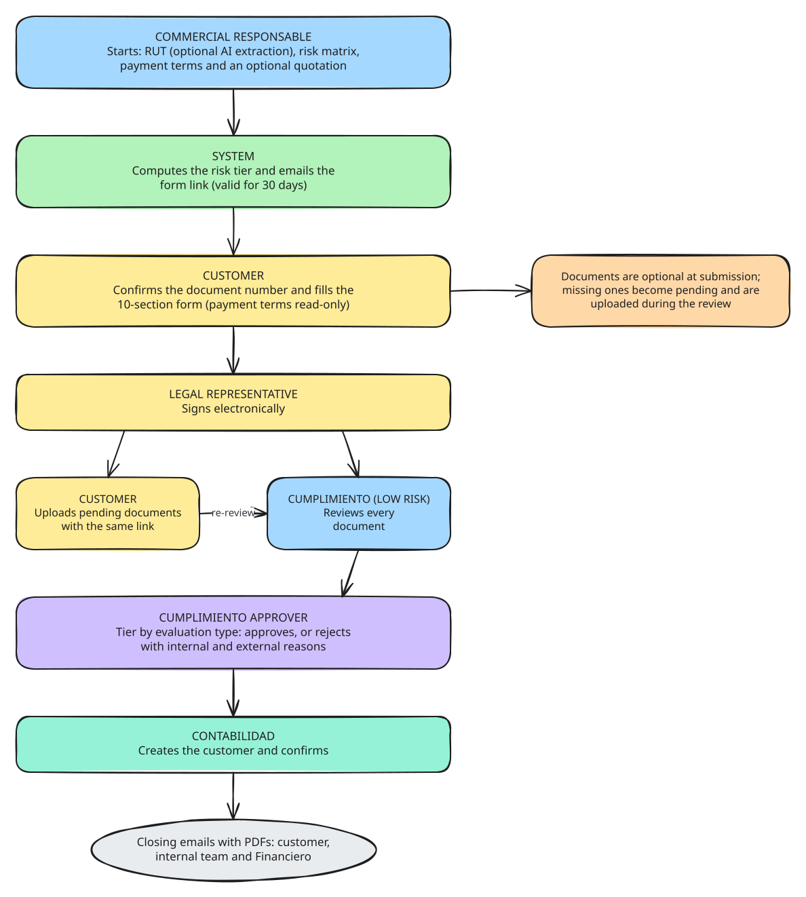
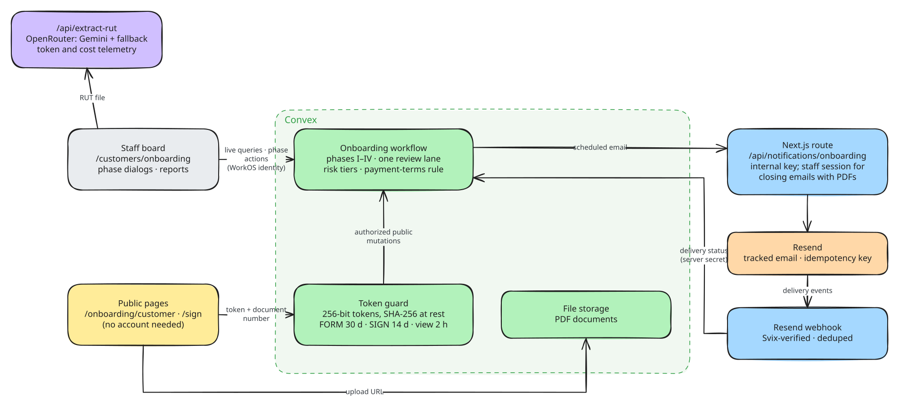

# Customers: onboarding with payment terms and tiered approval

Module guide for [Lab Trxckin](../README.md). All companies, NITs and emails in this repo are fictional demo data. The shared onboarding foundation (roles, access levels, tokens, emails) is described in [onboarding.md](onboarding.md), and the supplier variant in [suppliers.md](suppliers.md).

<picture>
  <source media="(prefers-color-scheme: dark)" srcset="diagrams/customers-operational.dark.svg">
  
</picture>

## Context

Selling on credit to a new customer carries the same compliance duties as paying a new supplier: know who the customer is, how risky the relationship is and which documents back it up. On top of that, the commercial team has to agree payment terms before the customer is created in the accounting system.

The customers module reuses the supplier onboarding foundation and adapts it to that commercial flow: the salesperson sets the payment terms, the customer fills and signs a public form, compliance reviews the documents, a tiered approver decides and accounting creates the customer.

## My role

I built the module on top of the shared onboarding foundation as part of Lab Trxckin: the customer state machine, the payment-terms rules, the customer form (reusing the supplier sections), the closing emails with PDFs and the tests.

## Tech and why

| Choice | Why |
| --- | --- |
| **The shared onboarding foundation** | Tokens, tracked emails, access levels and risk libraries are reused unchanged; only the phases and the form differ. |
| **Reused form sections with a field mapping** | The customer form uses the supplier section components; a payload builder maps field keys, so fixes land in both forms. |
| **Server-side payment-terms rule** | `Anticipado` forces the term to *NA*; `Contado` and `Crédito` require 15–120 days. The customer sees the terms read-only. |
| **Browser-built PDFs attached to the closing emails** | The signed form and the phase-time report go to the customer, the internal team and Financiero. |

## Results and learnings

- One review lane instead of two: every document is reviewed by Cumplimiento, and approval escalates by risk tier exactly like suppliers.
- Documents are optional at submission, so the customer is not blocked by a missing certificate; missing documents become pending after signing and are uploaded during the review with the same link.
- **Reuse beats copy-paste.** Sharing form sections and the onboarding foundation kept two similar workflows consistent while letting each keep its own rules.

## How it works

1. **Commercial responsable:** starts the process on `/customers/onboarding`: uploads the RUT (optional AI extraction), enters the customer and risk data, sets the **payment terms**, and can attach a quotation and pre-load documents. The company's ERP customer catalog decides whether it is a new registration or an update (picked by hand only if the check cannot run); a process still in progress for the same document blocks a new one ([erp.md](erp.md)).
2. **System:** computes the risk tier and emails the form link (valid for 30 days).
3. **Customer:** confirms the registered document number and fills the **10-section form** (payment terms read-only). Documents can be uploaded now or later.
4. **Legal representative:** signs electronically.
5. **Customer and Cumplimiento (low risk):** the customer uploads any pending documents with the same link while Cumplimiento reviews each one. Rejected documents are emailed back to the customer.
6. **Cumplimiento approver:** the tier for the evaluation type approves, or rejects with an internal reason and a reason the customer sees on their status page.
7. **Contabilidad:** creates the customer ("Crear en ERP" registers it in the simulated ERP) and confirms, with optional closing notes. The closing emails with PDFs go to the customer, the internal team and Financiero.

## Technical design

<picture>
  <source media="(prefers-color-scheme: dark)" srcset="diagrams/customers-technical.dark.svg">
  
</picture>

### Phases

| Phase | Owner | Leaves when |
| --- | --- | --- |
| I Análisis de riesgo | Commercial responsable (auto-completed) | The process is created |
| II Pendiente formulario | Customer | The form is submitted (documents optional) |
| IIA Pendiente firma | Legal representative | The form is signed |
| III Revisión documental | Cumplimiento (low risk) | Every document is approved |
| IIIA Aprobación Cumplimiento | Tier approver by evaluation type | Approved (→ IV) or rejected |
| IV Creación Contabilidad | Contabilidad | Creation confirmed → **Completado** |

Returns and annulment work as for suppliers; see [onboarding.md](onboarding.md).

### Differences from suppliers

- No Compras lane and no purchasing rubric.
- The payment terms (`condicionesPago_12`) are set internally and never patchable from the public form.
- The customer chooses nothing about routing: approval depends only on the evaluation type.
- Fewer notifications: no email after signing, none to Contabilidad when phase IIIA is approved, and none to the customer on rejection.

## Code map

- [`convex/onboarding/customers.ts`](<../apps/frontend/convex/onboarding/customers.ts>): internal state machine (phases I–IV with the IIIA tier)
- [`convex/onboarding/customersPublic.ts`](<../apps/frontend/convex/onboarding/customersPublic.ts>): public form, submission, signing, uploads
- [`convex/lib/onboarding/customersDocs.ts`](<../apps/frontend/convex/lib/onboarding/customersDocs.ts>): review lane, tax rules, payment-terms rule
- [`lib/onboarding/documents/customers.ts`](<../apps/frontend/lib/onboarding/documents/customers.ts>): required documents
- [`customers/onboarding/`](<../apps/frontend/app/(default)/customers/onboarding/>): internal board, phase dialogs, PDFs
- [`(public)/onboarding/customer/`](<../apps/frontend/app/(public)/onboarding/customer/>): public form and signing page
- [`api/notifications/onboarding/customer/route.tsx`](<../apps/frontend/app/api/notifications/onboarding/customer/route.tsx>): email route

## Tests

- [`onboardingCustomers.test.ts`](<../apps/frontend/convex/onboardingCustomers.test.ts>): payment-term rule, the full flow including internal replacements, the exact notification list, tiered approval, returns (including rotating the form link) and annulment
- [`onboardingFoundation.test.ts`](<../apps/frontend/convex/onboardingFoundation.test.ts>): tokens and tracked emails shared with suppliers
- [`onboardingProcesosPorDocumento.test.ts`](<../apps/frontend/convex/onboardingProcesosPorDocumento.test.ts>): one process in progress per document and the existing-process alert, shared with suppliers

## Known limitations

This is a portfolio extraction and hardening is ongoing. Server-side authorization for this module is described in the README's [security notes](../README.md#security-notes-and-known-limitations). Still open:

- The notification gaps listed above: the customer learns about a rejection only on the status page.
- Creating the customer in the accounting system is still a manual confirmation ("Crear en ERP" writes to the simulated ERP only), and closing emails depend on the browser tab staying open after the confirmation.
