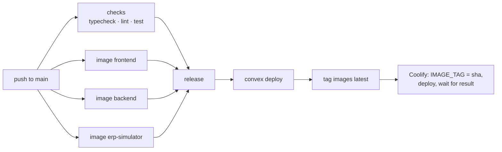

# Deploying to Coolify

Production runs on a Coolify server with the **Docker Compose** build pack, while Convex and Postgres stay managed. GitHub Actions builds the images and Coolify only pulls them, so the server never builds anything.

| Piece | Runs on | Public |
| --- | --- | --- |
| Next.js (`apps/frontend`) | Coolify, `frontend` service, port 3000 | yes, the app domain |
| NestJS (`apps/backend`) | Coolify, `backend` service, port 8000 | no, only the Next server calls it |
| ERP simulator (`apps/erp-simulator`) | Coolify, `erp-simulator` service, port 8100 | no, only the backend calls it |
| Convex functions (`apps/frontend/convex`) | Convex Cloud, production deployment | yes (Convex URL) |
| App DB and ERP simulator DB | Neon, two databases | no |

The stack is defined in [`docker-compose.coolify.yml`](../docker-compose.coolify.yml). Each app has its own Dockerfile in `apps/*/Dockerfile`, built from the repo root. The pipeline is [`.github/workflows/deploy.yml`](../.github/workflows/deploy.yml).

## How a deploy works



1. **Checks and builds.** The CI checks (`ci.yml`) and the three image builds start at the same time.
   - Images are pushed to GHCR as `ghcr.io/sxntixgxs/lab-trxckin-<app>:sha-<commit>`.
   - Builds reuse a per-app layer cache, so an app whose code and dependencies didn't change rebuilds from cache.
2. **Release.** It only runs when every check and every image passed, and only on `main`.
   1. It deploys the Convex functions with `npx convex deploy`, before the frontend that may call them.
   2. It moves the `latest` tags.
   3. It sets the Coolify variable `IMAGE_TAG` to `sha-<commit>`, so Coolify runs exactly the images that were tested.
   4. It triggers the Coolify deploy and waits for the result, so a failed deploy turns the workflow red.
3. **Coolify.** It pulls the images and recreates the containers.
   - `backend-migrate` runs `prisma migrate deploy`. The backend only starts once it succeeds.
   - `erp-simulator-init` runs the simulator's migrations and its demo seed, and the simulator only starts once it succeeds. The seed only inserts missing rows, so running it on every deploy is safe.
   - The frontend doesn't wait for the backend. If a backend deploy fails, the site stays up, and so do the public onboarding forms, which only need Convex.

**Other triggers:**
- Pull requests build the three images without pushing them, so a broken Dockerfile shows up before merge.
- Pushes that only touch `docs/` or Markdown files don't deploy.
- Runs on `main` queue up; they never overlap.

Each deploy recreates the containers, so expect a short gap (seconds) per service. Coolify has no rolling updates for compose applications.

## One-time setup

Secrets go straight into Convex, GitHub or Coolify. Never commit them or paste them into issues. Generate the shared secrets with `openssl rand -hex 32`.

In the steps below, `<APP_DOMAIN>` is the app's domain without a scheme, for example `app.example.com`.

### 1. WorkOS

Use the production environment of your WorkOS project: its client id and API key.

You don't configure its redirect URI, homepage or CORS origin by hand. Every `convex deploy` sets them to `https://<APP_DOMAIN>` through the `authKit.prod` section of `apps/frontend/convex.json`. If signing out lands on the wrong page, set the sign-out redirect in WorkOS to `https://<APP_DOMAIN>`.

### 2. Convex production deployment

In the Convex dashboard, open the project's **Production** deployment and go to Settings → Environment Variables. Set the variables below before the first deploy: the deploy fails without the WorkOS ones.

| Name | Value |
| --- | --- |
| `WORKOS_CLIENT_ID`, `WORKOS_API_KEY` | Production WorkOS values. `convex deploy` uses the API key to configure AuthKit. |
| `CONVEX_SERVER_SECRET` | Generated. Same value as in Coolify. |
| `NOTIFICATIONS_INTERNAL_KEY` | Generated. Same value as in Coolify. |
| `FACTURACION_SLA_DIGEST_SECRET` | Generated. Same value as in Coolify. |
| `FRONTEND_URL` | `https://<APP_DOMAIN>`. It must have the same origin as the app URL, or the notification routes reject Convex's links. |
| `ENABLE_BACKGROUND_JOBS` | `true` once the Microsoft Graph variables are set. |
| `DEFAULT_CONTACT_EMAIL`, `FACTURACION_GRAPH_MAILBOXES`, `MS_*` | Optional. See [Environment variables](../README.md#environment-variables) and [billing-azure-setup.md](billing-azure-setup.md). |

Then create a **production deploy key** (Settings → URL & Deploy Key) and note the deployment URL (`https://<name>.convex.cloud`).

### 3. Neon

Create two databases: one for the app and one for the ERP simulator. Never point the simulator at the app database. For each one, copy the **pooled** connection string (the host contains `-pooler`) and the **direct** one; migrations should not go through the pooler.

### 4. GitHub

Repository variables, which are public values:

```bash
gh variable set APP_DOMAIN --body "app.example.com"
```

```bash
gh variable set NEXT_PUBLIC_CONVEX_URL --body "https://<name>.convex.cloud"
```

Secrets live in a `production` environment, and only the release job can read them. Create the environment:

```bash
gh api -X PUT repos/sxntixgxs/lab-trxckin/environments/production
```

Then set each secret. `gh` prompts for the value, so it doesn't end up in your shell history:

```bash
gh secret set CONVEX_DEPLOY_KEY --env production
```

```bash
gh secret set COOLIFY_URL --env production
```

```bash
gh secret set COOLIFY_TOKEN --env production
```

```bash
gh secret set COOLIFY_APP_UUID --env production
```

| Secret | Value |
| --- | --- |
| `CONVEX_DEPLOY_KEY` | The production deploy key from step 2 |
| `COOLIFY_URL` | Your Coolify dashboard URL, e.g. `https://coolify.example.com` |
| `COOLIFY_TOKEN` | Coolify → Keys & Tokens → API tokens, with the **read**, **write** and **deploy** permissions |
| `COOLIFY_APP_UUID` | The application's UUID (it's in its Coolify URL), from step 6 |

The workflow logs are public because the repository is public. The Coolify step prints only deployment statuses and Coolify's messages.

### 5. Coolify server: pull access to GHCR

The images are private. On the server, log Docker in to GHCR once, as the user Coolify runs Docker as (normally `root`). Use a classic GitHub token that only has the `read:packages` scope:

```bash
docker login ghcr.io -u sxntixgxs
```

### 6. Coolify application

1. **New Resource** → Public Repository `https://github.com/sxntixgxs/lab-trxckin` (or via the GitHub App), branch `main`.
2. **Build pack:** Docker Compose. **Base Directory:** `/`. **Docker Compose Location:** `/docker-compose.coolify.yml`.
3. Turn **Auto Deploy** off if it's on. Deploys come from the workflow, after the images exist.
4. In the `frontend` service, set **Domains** to `https://<APP_DOMAIN>:3000`. `:3000` tells the proxy which container port to use; visitors still use 443. Leave the other services without a domain.
5. Fill the variables, which Coolify lists after loading the compose file:

| Name | Required | Value |
| --- | --- | --- |
| `APP_URL` | yes | `https://<APP_DOMAIN>` |
| `WORKOS_CLIENT_ID`, `WORKOS_API_KEY` | yes | Production WorkOS values |
| `CONVEX_SERVER_SECRET`, `NOTIFICATIONS_INTERNAL_KEY`, `FACTURACION_SLA_DIGEST_SECRET` | yes | Same values as in Convex |
| `DATABASE_URL` | yes | App DB, pooled |
| `DIRECT_URL` | recommended | App DB, direct (used by migrations) |
| `ERP_SIM_DATABASE_URL` | yes | ERP simulator DB, pooled |
| `ERP_SIM_DIRECT_URL` | recommended | ERP simulator DB, direct (migrations and seed) |
| `RESEND_API_KEY`, `RESEND_FROM_EMAIL`, `RESEND_WEBHOOK_SECRET` | no | Email notifications and delivery tracking |
| `OPENROUTER_API_KEY` | no | AI extraction of the RUT in onboarding |
| `ERP_SYNC_PROGRAMADA` | no | `false` turns off the nightly ERP sync (default `true`) |

Two kinds of variable need no input:
- `IMAGE_TAG` is written by the workflow.
- `SERVICE_PASSWORD_64_*` are generated by Coolify on the first deploy and shared by the services that use them: the WorkOS cookie password, the impersonation cookie key, the Next → Nest internal key and the ERP ConniKey/ConniToken.

Coolify makes every variable of the resource available to every container. The apps only read their own.

Don't press Deploy in Coolify before the first workflow run: the images don't exist yet.

### 7. First deploy

1. Merge to `main`, or run **Deploy** from the Actions tab on `main`.
2. When the workflow is green, make yourself admin. Your user must exist in the production WorkOS environment; signing in once at `https://<APP_DOMAIN>` creates it. Then open the backend container's **Terminal** in Coolify and run:

   ```bash
   node_modules/.bin/tsx scripts/promote-admin.ts you@example.com
   ```

3. If you use Resend delivery tracking, point its webhook at `https://<APP_DOMAIN>/api/webhooks/resend/onboarding`.
4. The nightly ERP sync fills the supplier/customer catalog. To fill it now, use Administración → Terceros ERP or the backend terminal:

   ```bash
   node_modules/.bin/tsx scripts/erp-sync.ts
   ```

## Operations

| Task | How |
| --- | --- |
| Redeploy the current version | Coolify → Redeploy. `IMAGE_TAG` still points at the last deployed commit. |
| Roll back the app | Set `IMAGE_TAG` in Coolify to an earlier `sha-<commit>` (listed under the repository's Packages, or in a previous Deploy run) and redeploy. The next push to `main` moves it forward again. |
| Roll back Convex | Revert the commit on `main`. The next run deploys the reverted functions. |
| Run a backend script | Coolify terminal on `backend`: `node_modules/.bin/tsx scripts/<script>.ts`. The scripts read the container's variables. |
| Reset the simulator's demo data | Coolify terminal on `erp-simulator`: `node_modules/.bin/tsx prisma/seed.ts --reset`. This deletes terceros created through the connector too. |
| See migration or seed output | Logs of the `backend-migrate` / `erp-simulator-init` containers in Coolify |

## Troubleshooting

**`convex deploy` fails with "Environment variable WORKOS_CLIENT_ID is used in auth config file but its value was not set"**
The production deployment is missing the WorkOS variables; see step 2. The same step also fails when `WORKOS_API_KEY` is missing, because the CLI needs it to configure AuthKit.

**`convex deploy` fails with "Cannot resolve template ${buildEnv.APP_DOMAIN}"**
The `APP_DOMAIN` repository variable is not set.

**Coolify can't pull the images (`denied` / `unauthorized`)**
The server isn't logged in to GHCR as the user that runs Docker, or the token lacks `read:packages`.

**`backend-migrate` fails and the backend never starts**
Its logs show Prisma's error, and the backend stays down until a migration succeeds.
- With Neon, set `DIRECT_URL`: migrations through the pooled URL can fail.
- If a migration failed halfway, Prisma refuses to continue (`P3009`). Fix the database, then mark the migration from your machine against the direct URL: `pnpm --filter backend exec prisma migrate resolve --rolled-back <migration>`. Then redeploy.

**After signing in, the browser lands on `0.0.0.0:3000`**
The frontend image was built without `NEXT_PUBLIC_APP_URL`. Check the `APP_DOMAIN` repository variable and rebuild. The build fails on `main` when it's missing.

**Notification emails from Convex are rejected with 401**
Check two things:
- The three shared secrets must be identical in Convex and Coolify.
- The HMAC-signed routes (SLA digest, sync alerts) accept a 5-minute window, so the server's clock must be in sync (NTP).

## Building an image locally

From the repo root. The frontend needs its public build arguments; any valid URLs work for a local check.

```bash
docker build -f apps/backend/Dockerfile -t lab-trxckin-backend .
```

```bash
docker build -f apps/frontend/Dockerfile --build-arg NEXT_PUBLIC_CONVEX_URL=https://placeholder.convex.cloud --build-arg NEXT_PUBLIC_APP_URL=http://localhost:3000 --build-arg NEXT_PUBLIC_WORKOS_REDIRECT_URI=http://localhost:3000/callback -t lab-trxckin-frontend .
```
