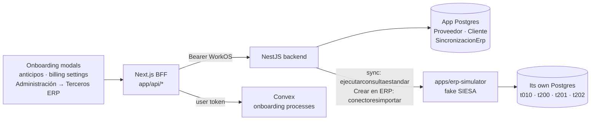

# ERP catalog and the SIESA simulator

The supplier and customer onboarding modules must know whether a third party (tercero) already exists in the accounting ERP (SIESA): an existing one is an **ACTUALIZACIÓN**, a new one an **INSCRIPCIÓN**. The advance request and the billing settings also look suppliers up there. The original internal tool queried SIESA Cloud live. This portfolio has no SIESA access, so it ships:

- **`apps/erp-simulator`**: a small NestJS app with its **own Postgres database** that imitates SIESA Cloud's API (same paths, `ConniKey`/`ConniToken` headers, `{ codigo, mensaje, detalle }` envelopes, HTTP 400 "No se encontraron registros").
- **A local catalog in the app database** (`Proveedor`, `Cliente`) that the backend fills from the ERP with a sync (daily, on demand and from the CLI). Existence checks and supplier searches read this catalog, never the ERP directly.

Going live means pointing `ERP_BASE_URL` at `https://servicios.siesacloud.com` with real credentials; no code changes.



## Where the code lives

| Area | Path |
| --- | --- |
| Fake SIESA API | `apps/erp-simulator/src/siesa/` — `consultas.*` (standard queries), `conectores.*` (import connector), `parametros.ts` (filter grammar), `filtros.ts` (field whitelist), `proyecciones.ts` (row shape) |
| Fake SIESA data | `apps/erp-simulator/prisma/schema.prisma`, `prisma/seed.ts`, `src/datos/` (companies, curated demo terceros, deterministic generator, DIAN check digit) |
| ERP client and sync | `apps/backend/src/erp/` — `siesa/siesa-client.ts`, `siesa/siesa-filas.ts`, `siesa/conector-tercero.ts`, `sync/sincronizador-erp.ts`, `sync/plan-sincronizacion.ts`, `sync/erp-sync.scheduler.ts`, `erp.config.ts` |
| Catalog reads | `apps/backend/src/terceros/` — `/proveedores/search`, `/proveedores/existe`, `/clientes/existe`, `/erp/catalogo/:entidad` |
| CLI sync | `apps/backend/scripts/erp-sync.ts` (`pnpm --filter backend erp:sync`) |
| BFF routes | `apps/frontend/app/api/proveedores/{search,existe}`, `app/api/clientes/existe`, `app/api/erp/{sincronizaciones,catalogo/[entidad],terceros}`, helpers in `lib/erp/` |
| Onboarding checks | `components/onboarding/use-verificacion-tercero.ts`, `verificacion-tercero-panel.tsx`, `registro-erp-panel.tsx`; Convex `convex/lib/onboarding/procesosPorDocumento.ts`, `convex/onboarding/erp.ts` |
| Admin page | `app/(default)/administracion/terceros-erp/` (route permission `administracion/terceros-erp`) |

## The fake SIESA API

Both endpoints require the `ConniKey` and `ConniToken` headers (`ERP_SIM_CONNI_KEY` / `ERP_SIM_CONNI_TOKEN`). Swagger at `http://localhost:8100/docs` in development.

### `GET /api/siesa/v3/ejecutarconsultaestandar`

| Param | Example | Notes |
| --- | --- | --- |
| `idCompania` | `5001` | SIESA Cloud instance (connection). Unknown ids answer 400. |
| `descripcion` | `API_v2_Proveedores` | `API_v2_Proveedores` (t200 ⋈ t202, one row per supplier branch), `API_v2_Clientes` (t200 ⋈ t201), `API_v2_Companias` (t010). |
| `paginacion` | `numPag=1\|tamPag=100` | Page size up to 1000; stable order by primary key. |
| `parametros` | `f200_id_cia = 7 AND f200_nit = ''900222333''` | Whitelisted grammar: `cond [AND cond]*`, operators `=` and `>=`, values integers or `'text'` / `''text''`. Fields: `f200_id_cia`, `f200_nit`, `f200_id`, `f200_ind_estado`, `f200_ind_tipo_tercero`, `f200_fecha_actualizacion`, plus `f202_*`/`f201_*` branch fields. Turned into a Prisma `where`, never into SQL. |

- **200:** `{ "codigo": 0, "mensaje": "Transacción Exitosa", "detalle": { "Table": [ { "f200_rowid": 12, "f200_nit": "900222333", "f202_id_sucursal": "001", ... } ] } }`.
- **400, no match or page past the end:** `{ "codigo": 1, "mensaje": "Error", "detalle": "No se encontraron registros" }`, exactly like SIESA.
- **400, bad params:** SIESA-like message.
- **401:** wrong credentials.

### `POST /api/siesa/v3.1/conectoresimportar?idCompania=5001&nombreDocumento=tercero-proveedor`

```json
{
  "Inicial": [{ "F_CIA": 1 }],
  "Tercero": [{
    "F200_ID": "900123456", "F200_NIT": "900123456", "F200_DV_NIT": "8",
    "F200_ID_TIPO_IDENT": "N", "F200_IND_TIPO_TERCERO": 2,
    "F200_RAZON_SOCIAL": "ACME Colombia S.A.S.",
    "F200_IND_CLIENTE": 0, "F200_IND_PROVEEDOR": 1, "F200_ID_CIIU": "2599",
    "F015_EMAIL": "...", "F015_CIUDAD": "Bucaramanga"
  }],
  "Proveedor": [{ "F202_ID_SUCURSAL": "001", "F202_DESCRIPCION_SUCURSAL": "ACME Colombia S.A.S.", "F202_ID_COND_PAGO": "C30" }],
  "Final": [{ "F_CIA": 1 }]
}
```

- **Validation:** checks required fields and the DIAN check digit for type `N`, and collects every error: `400 { codigo: 1, mensaje: "Errores en la importación", detalle: [{ nivel, campo, mensaje }] }`.
- **Idempotent:** the tercero is matched by company and document number, ignoring zero padding; its cliente/proveedor flags are OR-merged and the branches upserted. The answer says whether it was `CREADO` or `ACTUALIZADO`.
- **Logged:** every call is stored in `importaciones`.

### Companies

The app's companies map to SIESA partitions the same way as the cost-center catalog (`lib/centro-costo-catalog-scope.ts`).

| App empresa | Instance (`idCompania`) | Company (`f200_id_cia`) |
| --- | --- | --- |
| 1 Andes Logística | 5001 | 1 |
| 2 Cordillera Minería | 5002 | 1 |
| 3 Pacífico Ingeniería | 5001 | 7 |
| 4 Altiplano Holding | 5001 | 13 |

### Demo data

`pnpm --filter erp-simulator prisma:seed` loads deterministic data: the curated cases below plus about 120 generated terceros per company (valid DIAN check digits, some natural persons, some inactive, some with two branches). Re-running only inserts what is missing; `--reset` rebuilds everything.

| Empresa | NIT | Tercero | Shows |
| --- | --- | --- | --- |
| 1 | 900222333 | Distribuidora Andina del Norte S.A.S. — proveedor with branches 001 Bogotá and 002 Medellín | ACTUALIZACIÓN; branch picker in the advance request |
| 1 | 900444555 | Transportes Cóndor S.A.S. — inactive proveedor | "Inactivo en ERP" (still an ACTUALIZACIÓN) |
| 1 | 800666777 | Ferretería El Nevado S.A.S. — cliente and proveedor | ACTUALIZACIÓN in both modules |
| 1 | 52123456 (C.C.) | María Fernanda Ruiz Castaño — natural person, proveedor | Document without check digit |
| 2 | 901777888 | Suministros Mineros del Norte S.A.S. — proveedor only in empresa 2 | Per-company scope (INSCRIPCIÓN in empresa 1) |
| 3 | 0890123456 | Servicios Técnicos del Valle S.A.S. — cliente, zero-padded in the ERP | NIT normalization (type 890123456) |

**ACME (900123456) is not seeded on purpose:** its first process is an INSCRIPCIÓN; after "Crear en ERP" in the last phase, the next ACME process is detected as an ACTUALIZACIÓN.

## The catalog and the sync

`Proveedor` and `Cliente` (app database) hold one row per company, document and branch, with the tercero and branch states and the ERP code (`erp_tercero_id`, the `id` of the search contract that advance requests store as `siesaId`). `SincronizacionErp` records every run (catalog, company, scope, origin, state, counts, error, user).

A run fetches every page from the ERP first; the database is only touched afterwards, inside one transaction per catalog and company:

- **Serialization.** A transaction-level advisory lock serializes runs of the same catalog and company. Full runs skip (`OMITIDA`) when it is busy or when a newer full run already succeeded. Targeted runs (one NIT, after "Crear en ERP") wait for it.
- **Safety.** A failed fetch changes nothing. An empty answer for a scope that has rows fails the run (`FALLIDA`) and keeps the catalog, so a misconfigured company cannot wipe it. Rows written by a newer run are never updated or deleted by an older one.
- **Interrupted runs.** A run left `EN_CURSO` for 30 minutes is closed as `FALLIDA` by the next run.

Triggers:

| Trigger | How |
| --- | --- |
| Daily | In-process job (`@nestjs/schedule`), `ERP_SYNC_CRON` (default `0 0 2 * * *`, `America/Bogota`); `ERP_SYNC_PROGRAMADA=false` turns it off |
| On demand | Administración → Terceros ERP → "Sincronizar ahora" (`POST /api/v1/erp/sincronizaciones`, answers 202 and runs in the background) |
| CLI | `pnpm --filter backend erp:sync [--empresa 1] [--entidad proveedores]` |

## How onboarding uses it

- **Request type.** The "Iniciar proceso" modals check `GET /api/{proveedores,clientes}/existe` as soon as a document is typed, read from the RUT or filled with the ACME button.
  - The match accepts the NIT with or without its check digit and ignores zero padding. A cédula never loses or gains a digit.
  - An existing tercero, active or inactive, makes it an ACTUALIZACIÓN; otherwise it is an INSCRIPCIÓN.
  - Only when the check cannot run (backend down, or a catalog that was never synced) does the user pick by hand. The process then stores `tipoSolicitudOrigen: "MANUAL"` (otherwise `"ERP"`).
- **Existing processes.** The same modal lists the onboarding processes of that company for the document (Convex `obtenerProcesosPorDocumento`):
  - In-progress processes block a new one, enforced again in `crearMatrizRiesgo` with `PROCESO_EN_CURSO`. `devolverFase` refuses to reopen a closed process while another is in progress.
  - Finished processes (COMPLETADO, RECHAZADO) are listed too; ANULADA ones are hidden.
  - "Ver detalle" opens the process detail stacked over the modal, keeping the form.
  - A process the user cannot see (responsable-level access) shows only its state and responsable.
- **Crear en ERP.** In suppliers Fase VI and customers Fase IV:

```mermaid
sequenceDiagram
    participant UI as Fase VI / IV dialog
    participant BFF as Next /api/erp/terceros
    participant CX as Convex
    participant N as Nest /api/v1/erp/terceros
    participant E as ERP (simulator)
    UI->>BFF: POST { modulo, inscripcionId }
    BFF->>CX: datosParaCrearEnErp (user token; phase actor only)
    CX-->>BFF: tercero data
    BFF->>N: POST (x-internal-key + user token)
    N->>E: conectoresimportar
    E-->>N: f200_id, branch, CREADO / ACTUALIZADO
    N->>E: ejecutarconsultaestandar (that NIT)
    N-->>BFF: result + catalog existence
    BFF->>CX: registrarCreacionEnErp (server secret)
    CX-->>UI: registroErp on the inscription
```

The tercero data comes from Convex, never from the browser, and Nest only accepts the call from the BFF (internal key). The inscription keeps `registroErp` (ERP code, branch, action, whether the catalog already reflects it); the confirmation checkbox stays.

## Local setup

1. Create a second database in your Neon project (for example `erp_sim`).
2. Copy `apps/erp-simulator/.env.example` to `.env`; set `ERP_SIM_DATABASE_URL` / `ERP_SIM_DIRECT_URL` and any values for `ERP_SIM_CONNI_KEY` / `ERP_SIM_CONNI_TOKEN`.
3. `pnpm --filter erp-simulator prisma:migrate` and `pnpm --filter erp-simulator prisma:seed`.
4. In `apps/backend/.env`: `ERP_BASE_URL=http://localhost:8100` and `ERP_CONNI_KEY` / `ERP_CONNI_TOKEN` equal to the simulator's.
5. `pnpm --filter backend prisma:migrate` (creates the catalog; it empties the old invoice-derived `Proveedor` rows) and `pnpm --filter backend prisma:seed` (grants the new route permission to admins).
6. Start the simulator (`pnpm dev` starts it with the rest) and run `pnpm --filter backend erp:sync`. Until the first sync the existence checks answer "catalog not synced" and the modals fall back to the manual choice.
7. For "Crear en ERP", set `NEST_INTERNAL_KEY` in `apps/frontend/.env.local` (same value as the backend).

## Going live with SIESA

Set `ERP_BASE_URL=https://servicios.siesacloud.com`, the real `ERP_CONNI_KEY` / `ERP_CONNI_TOKEN`, and the real instance ids in `ERP_INSTANCIA_1_ID_COMPANIA` / `ERP_INSTANCIA_2_ID_COMPANIA`. Things to review against the real tenant:

- The client uses one credential pair for every instance. The original tool had one per instance; add a map in `erp.config.ts` if needed.
- The row mapping (`siesa-filas.ts`) reads the column names SIESA's standard queries return (`f200_*`, `f201_*`, `f202_*`, `f015_*`), case-insensitively.
- The import document (`conector-tercero.ts`) sends a minimal set of `F200_*` / `F201_*` / `F202_*` fields. Real SIESA connectors usually require more (tax regime, classes, currency), configured per tenant.
