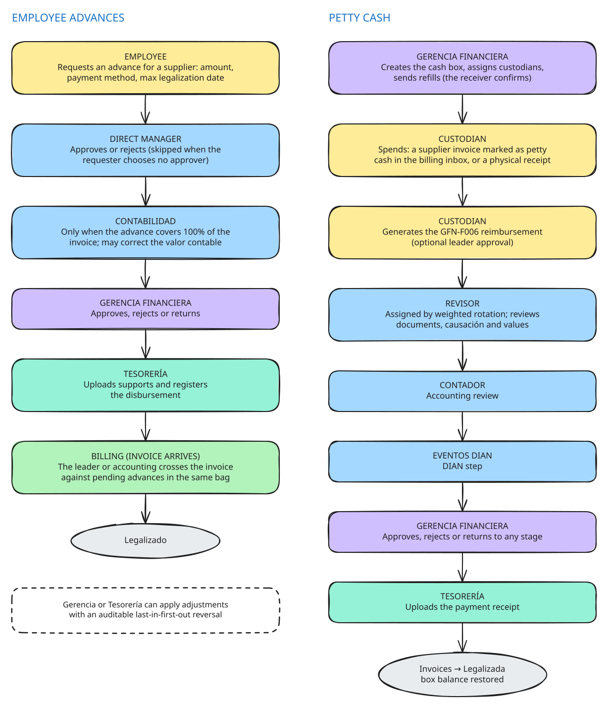
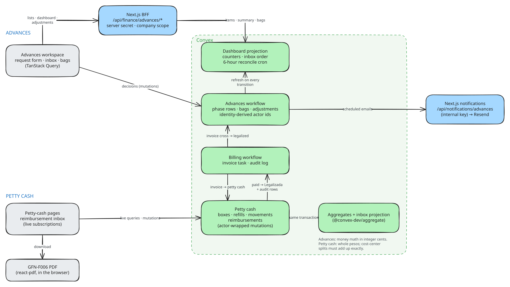

# Finance: employee advances and petty cash

Module guide for [Lab Trxckin](../README.md). All companies, NITs and emails in this repo are fictional demo data.

<picture>
  <source media="(prefers-color-scheme: dark)" srcset="diagrams/finance-operational.dark.svg">
  
</picture>

## Context

Two money flows that usually live in spreadsheets and email threads:

- **Employee advances (*anticipos*).** An employee needs money paid up front to a supplier. The request must be approved, disbursed by treasury and later *legalized*: matched against the supplier's e-invoice so accounting can close it.
- **Petty cash (*cajas menores*).** Custodians hold small cash boxes, spend from them, and periodically ask for a reimbursement that goes through its own review chain before treasury refills the box.

Both depend on invoices, so both hand off into the [billing workflow](billing.md) instead of duplicating it.

## My role

I designed and built both flows as part of Lab Trxckin: the Convex tables and state machines, the adjustments ledger, the petty-cash reimbursement chain and its split-pane review workspace, the BFF routes, the dashboards and the tests.

## Tech and why

| Choice | Why |
| --- | --- |
| **Convex mutations** with identity-derived actors (`mutationConActor`, `mutationConActorIds`) | Every decision is transactional, and the acting user always comes from the login, so a client cannot claim to be someone else or an admin. |
| **A read model** for the advances workspace, refreshed on every transition and reconciled every 6 hours | Inbox ordering, workload and bag balances without scanning every advance. |
| **`@convex-dev/aggregate`** for petty cash | Counts and sums of available movements per box without full scans. |
| **Integer-cent arithmetic** (`convex/lib/money.ts`) for advance adjustments and legalization | Balances never drift by floating-point error. |
| **react-pdf in the browser** | The GFN-F006 reimbursement form is rendered on demand from a snapshot taken at generation time. |

## Results and learnings

- Petty cash writes its history into the invoice's own audit log, and an adapter shows reimbursement stages as invoice phases, so one timeline explains an invoice no matter which flow paid it.
- An invoice is **either** petty cash **or** an advance legalization, never both: marking one clears the other.
- **Adjustments are a ledger, not an edit.** Each correction, reimbursement or reconciliation is a new row with an idempotency key (`operacionId`) and an optimistic check on the expected value; reversals are last-in-first-out, so the history always adds up.
- **Returns should remember where they came from.** When Gerencia sends a reimbursement back, the earlier stage can resend it straight to Gerencia instead of walking the whole chain again.

## How it works

### Employee advances

1. **Employee** (`/finance/advances/request`): looks up the supplier NIT, enters the amount, payment method, maximum legalization date and supports, and chooses an approver (or skips the approval step).
2. **Direct manager or selected leader:** approves or rejects.
3. **Contabilidad** (a pool of users): only when the advance covers 100% of the invoice; may correct the *valor contable*, approve, reject or return.
4. **Gerencia Financiera:** approves, rejects or returns.
5. **Tesorería:** uploads supports and registers the disbursement. The advance becomes *pending legalization*.
6. **Billing:** when the supplier's invoice arrives, the process leader or accounting crosses it against pending advances **in the same bag** (company + process). When the legalized total reaches the legalizable value, the advance is **Legalizado**.

While an advance is pending legalization, Gerencia or Tesorería can apply adjustments: *corrección de desembolso* (up or down), *reintegro* (the employee returns money) and *cuadre con otros sistemas*. The latest adjustment can be reversed, even after the advance is legalized. Each change emails the stakeholders.

### Petty cash

1. **Gerencia Financiera:** creates the box, assigns custodians and sends refills. A box is blocked until the receiver confirms a refill.
2. **Custodian spends:** either a supplier invoice that a leader (who is a custodian) marks as petty cash in the billing inbox, or a physical receipt registered with its support. The balance must cover it unless negative balances are enabled for the company.
3. **Custodian** (`/billing/petty-cash-reimbursement`): selects pending movements and generates reimbursement `GFN-F006-<year>-<NNNN>`, optionally requiring a leader's approval.
4. **Revisor:** auto-assigned by weighted rotation; reviews documents, causación and values, then picks the contador.
5. **Contador → Eventos DIAN → Gerencia Financiera:** each can approve, return with a reason or reject; Gerencia can return to any earlier stage.
6. **Tesorería:** uploads the payment receipt. The reimbursement is *recibido*, its movements are *reembolsado*, the invoices close as **Legalizada** in billing, and the box balance is restored.

## Technical design

<picture>
  <source media="(prefers-color-scheme: dark)" srcset="diagrams/finance-technical.dark.svg">
  
</picture>

### Advances state machine

| From | Action | To | Who |
| --- | --- | --- | --- |
| (new) | `crearAnticipo` | II, or III / IV when the manager step is skipped | Users with the request permission |
| II Aprobación jefe directo | approve / reject | III (covers 100%) or IV / Rechazado | Assigned approver |
| III Revisión contabilidad | approve (may change *valor contable*) / reject / return | IV Gerencia / Rechazado / II | Contabilidad pool |
| IV Aprobación gerencia | approve / reject / return | IV Desembolso / Rechazado / III or II | Gerencia |
| IV Desembolso tesorería | register disbursement / return | V Pendiente legalización / IV Gerencia | Tesorero |
| V Pendiente legalización | invoice crosses reach the legalizable value | Completado (*Legalizado*) | Billing workflow |
| Completado | a cross is reverted or an adjustment raises the value | back to V | Billing / adjustments |
| II to IV Desembolso | annul | Anulado | Owner of the current phase |
| V Pendiente legalización | annul (voids its invoice crosses; refused if a crossed invoice is closed) | Anulado | Gerencia or Tesorería |

Phase rows (`anticiposFases`) keep the full history of every attempt, including returns. Adjustments (`anticiposAjustes`) enforce limits: a regular increase is capped at the approved value, the result can never drop below what is already legalized, and a stale `valorEsperado` is rejected with "El valor legalizable cambió".

### Petty-cash reimbursement chain

`pendiente_aprobacion_lider` (optional) → `pendiente_revision` → `pendiente_revision_impuestos` → `pendiente_eventos_dian` → `pendiente_aprobacion` → `pendiente_pago_tesoreria` → `recibido`, with `rechazado` returning the movements to the custodian. When one person holds consecutive roles, a phase skip writes synthetic, auditable events and fails if the plan changed since the screen opened (`destinoEsperado`).

The box balance is derived on read: assigned value + confirmed refills + received reimbursements − non-annulled movements − active legacy legalizations.

### Money

Advance adjustments and legalization reconciliation use integer cents. Petty-cash values are whole pesos, and cost-center splits (up to 20 per movement) must add up exactly.

### Main tables

| Table | Purpose |
| --- | --- |
| `anticipos`, `anticiposFases`, `anticiposAjustes` | Advance header, phase history, adjustment ledger |
| `bolsasAnticipos`, `facturacionAnticipoLegalizaciones` | Bags per company + process, invoice ↔ advance crosses |
| `anticiposDashboardItems`, `anticiposDashboardResponsables` | Workspace read model and current owners |
| `cajasMenores`, `cajasMenoresRefills`, `facturacionCajaMenorMovimientos` | Boxes, refills, movements |
| `cajasMenoresReembolsos`, `cajasMenoresReembolsoEventos`, `cajasMenoresReembolsoAdjuntos` | Reimbursements, their timeline and stage attachments |

## Code map

**Advances**
- [`finance/advances/workspace/anticipos-workspace.tsx`](<../apps/frontend/app/(default)/finance/advances/workspace/anticipos-workspace.tsx>): tabs for inbox, my requests, dashboard, bags and settings
- [`finance/advances/request/components/SolicitarAnticipoClient.tsx`](<../apps/frontend/app/(default)/finance/advances/request/components/SolicitarAnticipoClient.tsx>): request form
- [`finance/advances/dashboard/components/AnticipoAjusteSection.tsx`](<../apps/frontend/app/(default)/finance/advances/dashboard/components/AnticipoAjusteSection.tsx>): adjustments UI
- [`convex/financiero/anticipos.ts`](<../apps/frontend/convex/financiero/anticipos.ts>): tables and workflow mutations
- [`convex/financiero/anticiposAjustes.ts`](<../apps/frontend/convex/financiero/anticiposAjustes.ts>): adjustments and reversal
- [`convex/anticiposDashboard.ts`](<../apps/frontend/convex/anticiposDashboard.ts>): workspace queries, backfill and reconciliation
- [`convex/lib/bolsasAnticipos.ts`](<../apps/frontend/convex/lib/bolsasAnticipos.ts>), [`convex/lib/anticiposLegalizacionReconciliacion.ts`](<../apps/frontend/convex/lib/anticiposLegalizacionReconciliacion.ts>): bags and legalization
- [`api/finance/advances/`](<../apps/frontend/app/api/finance/advances/>): BFF routes; [`api/notifications/advances/route.tsx`](<../apps/frontend/app/api/notifications/advances/route.tsx>): emails

**Petty cash**
- [`finance/petty-cash/page.tsx`](<../apps/frontend/app/(default)/finance/petty-cash/page.tsx>): boxes, refills, review queues
- [`billing/petty-cash-reimbursement/page.tsx`](<../apps/frontend/app/(default)/billing/petty-cash-reimbursement/page.tsx>): reimbursement inbox and generation
- [`components/cajas-menores/reembolso-review-dialog.tsx`](<../apps/frontend/components/cajas-menores/reembolso-review-dialog.tsx>) and [`reembolso-workspace/`](<../apps/frontend/components/cajas-menores/reembolso-workspace/>): split-pane review workspace
- [`components/cajas-menores/reembolso-formato-pdf.tsx`](<../apps/frontend/components/cajas-menores/reembolso-formato-pdf.tsx>): GFN-F006 PDF
- [`convex/cajasMenores.ts`](<../apps/frontend/convex/cajasMenores.ts>): boxes, movements and the reimbursement chain
- [`convex/cajaMenorBandejaQueries.ts`](<../apps/frontend/convex/cajaMenorBandejaQueries.ts>), [`convex/lib/cajaMenorBandeja.ts`](<../apps/frontend/convex/lib/cajaMenorBandeja.ts>): inbox queries and aggregates

**Shared**
- [`convex/lib/money.ts`](<../apps/frontend/convex/lib/money.ts>): integer-cent helpers
- [`convex/lib/serverActor.ts`](<../apps/frontend/convex/lib/serverActor.ts>): identity-derived actor wrappers
- [`convex/lib/centrosCostoDistribucion.ts`](<../apps/frontend/convex/lib/centrosCostoDistribucion.ts>): cost-center splits

## Tests

- [`cajaMenorWorkflow.test.ts`](<../apps/frontend/convex/cajaMenorWorkflow.test.ts>): the whole petty-cash chain, including weighted reviewers, returns, phase skips and the billing hand-off (the largest suite in the repo)
- [`anticiposWorkflow.test.ts`](<../apps/frontend/convex/anticiposWorkflow.test.ts>): routing rules, returns, Tesorería supports
- [`anticiposAjustes.test.ts`](<../apps/frontend/convex/anticiposAjustes.test.ts>): limits, stale values, idempotency, reversal
- [`anticiposDashboard.test.ts`](<../apps/frontend/convex/anticiposDashboard.test.ts>), [`anticiposNotifications.test.ts`](<../apps/frontend/convex/anticiposNotifications.test.ts>): read model and email recipients
- [`cajaMenorFacturacionAdapter.test.ts`](<../apps/frontend/convex/cajaMenorFacturacionAdapter.test.ts>): reimbursement stages shown as invoice phases

## Known limitations

This is a portfolio extraction and hardening is ongoing. Server-side authorization for this module is described in the README's [security notes](../README.md#security-notes-and-known-limitations). Still open:

- Advances do not block self-approval (petty cash does), and the request emails typed in the form are used as recipients.
- Petty cash sends no email notifications yet, and toll (*peajes*) legalization is not part of this extraction.
