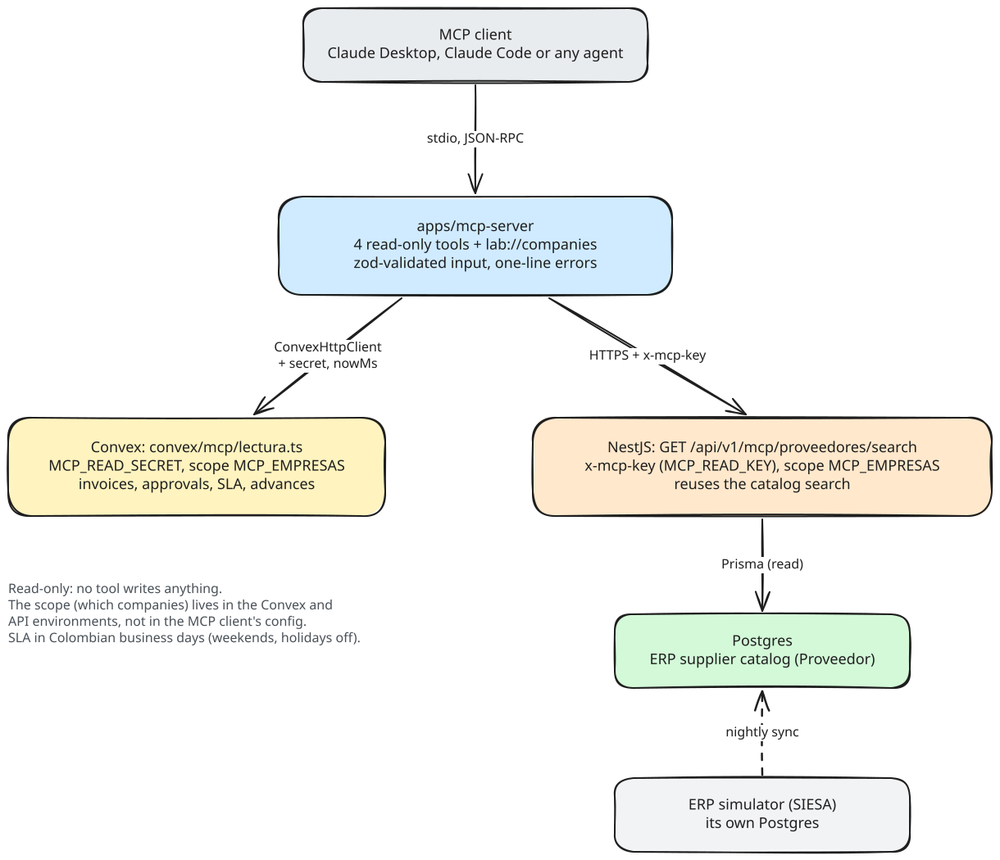

# MCP server: read-only agent access to invoices, approvals, advances and suppliers

Module guide for [Lab Trxckin](../README.md). All companies, NITs and emails in this repo are fictional demo data.

<picture>
  <source media="(prefers-color-scheme: dark)" srcset="diagrams/mcp-server.dark.svg">
  
</picture>

## Context

The questions finance people ask most are lookups: *where is this invoice, who has it, how late is it, how much of my advance is still open, is this supplier in the ERP?* The answers already live in Lab Trxckin, spread across the billing workflow, the advances module and the ERP catalog.

`apps/mcp-server` exposes those lookups to any [Model Context Protocol](https://modelcontextprotocol.io) client (Claude Desktop, Claude Code, an IDE or a custom agent), so an agent can answer them by calling tools against the real system instead of guessing. It is deliberately **read-only** and **scoped**: an agent can look, never act, and only inside the companies the operator allowed.

## Tools

| Tool | Input (zod-validated) | Returns |
| --- | --- | --- |
| `get_invoice_status` | `invoiceId`, or `invoiceNumber` (+ optional `supplierNit`, with or without check digit) | Phase, current owners, SLA: business days in phase, days left, due date, state (`healthy`, `warning`, `breached`) |
| `list_pending_approvals` | optional `companyId`, `assignee` (email or part of the name), `supplier` (name or NIT), `limit` ≤ 25 | Invoices waiting for approval, longest in their phase first, with owners and SLA |
| `get_advance_balance` | `advanceId`, `advanceNumber` or `requesterEmail` | Requested, settled against invoices, pending, phase, overdue settlement flag, and the total pending |
| `search_suppliers` | `query` (name, or 3+ NIT digits), optional `companyId`, `limit` ≤ 25 | Active suppliers from the SIESA-synced ERP catalog (NIT, legal name, branch) |
| Resource `lab://companies` | none | The companies this server may read |

Every tool is annotated `readOnlyHint: true`, `destructiveHint: false`, `idempotentHint: true`. SLAs are measured in **Colombian business days** (weekends and holidays excluded, Ley Emiliani included), using the same `computeSlaState` as the billing dashboard, recomputed at call time.

## Security model

- **Read-only.** No tool can write. The Convex functions behind it are queries (which cannot write), and the NestJS route is a `GET` over the catalog search. The worst a prompt injection can do is read demo data that is already in scope.
- **Dedicated credentials.** The server holds `MCP_READ_SECRET` for Convex and `MCP_READ_KEY` for NestJS. Neither is the app's server secret or internal key; they open nothing but the MCP read functions, and both are compared in constant time.
- **Scope lives on the server.** Which companies can be read is set by `MCP_EMPRESAS` **in the Convex deployment and in the API's environment**, not in the MCP client's config. A leaked or edited client config cannot widen it. Unset means no company; out-of-scope ids are refused (`Empresa fuera del alcance…`), and out-of-scope invoices read as *not found* instead of revealing that they exist.
- **Clear errors, no stack traces.** Invalid input is rejected by zod before any call; server errors are reduced to one line.
- **Small outputs.** Tools return the fields an agent needs (a dozen per invoice), not whole documents, which keeps tokens and cost down.

## How it works

| Piece | Where |
| --- | --- |
| MCP server (stdio, `@modelcontextprotocol/sdk`) | `apps/mcp-server/src/server.ts`, `lab-data.ts`, `index.ts` |
| Read-only Convex queries | `apps/frontend/convex/mcp/lectura.ts` (reads the `facturacionDashboardItems` projection and `anticipos`) |
| Secret and scope checks | `apps/frontend/convex/lib/mcpScope.ts`, `apps/backend/src/mcp/` |
| Demo data | `apps/frontend/convex/mcp/demo.ts` (invoices, owners, SLA thresholds, advances), `apps/erp-simulator/src/datos/demo.ts` (suppliers) |

`list_pending_approvals` scans at most 500 active invoices per company (it says so with `escaneoTruncado`), which is plenty for the demo; at real volume it would read an index ordered by phase start instead.

## Run it

1. **Secrets and scope.** Generate two random strings (`openssl rand -hex 32`), then:

   ```bash
   cd apps/frontend
   npx convex env set MCP_READ_SECRET <secret>
   npx convex env set MCP_EMPRESAS 2
   ```

   In `apps/backend/.env`: `MCP_READ_KEY=<key>` and `MCP_EMPRESAS=2`.

2. **Deploy and seed** (dev deployment only; `limpiar` removes exactly what `sembrar` created):

   ```bash
   npx convex dev --once
   npx convex run mcp/demo:sembrar '{"empresa": 2}'
   ```

   The suppliers come from the ERP simulator: `pnpm --filter erp-simulator prisma:seed`, then a catalog sync (`pnpm --filter backend erp:sync --empresa 2 --entidad proveedores`).

3. **Configure the server.** Copy `apps/mcp-server/.env.example` to `.env`: `LAB_CONVEX_URL`, `LAB_MCP_SECRET`, and optionally `LAB_API_URL` + `LAB_MCP_API_KEY` for `search_suppliers` (the tool is not registered without them). Run the API (`pnpm --filter backend start:dev`) if you use it.

4. **Try it by hand** with the MCP Inspector: `pnpm --filter mcp-server inspect`.

5. **Connect a client.** Build it (`pnpm --filter mcp-server build`), then for Claude Code:

   ```bash
   claude mcp add lab-trxckin -- node /absolute/path/to/apps/mcp-server/dist/index.js
   ```

   or in Claude Desktop's `claude_desktop_config.json`:

   ```json
   {
     "mcpServers": {
       "lab-trxckin": {
         "command": "node",
         "args": ["/absolute/path/to/apps/mcp-server/dist/index.js"],
         "env": { "LAB_CONVEX_URL": "https://…convex.cloud", "LAB_MCP_SECRET": "…" }
       }
     }
   }
   ```

   The server also reads `apps/mcp-server/.env` when it exists, so `env` can stay empty for local runs.

Then ask: *"¿Qué facturas de Drominc llevan más tiempo pendientes de aprobación?"* The agent calls `list_pending_approvals` with `supplier: "Drominc"` and gets DRM-1041 first (in Líder with Laura Méndez, past its 3-day SLA), then DRM-1063 in Tesorería, DRM-1052 in Causación and DRM-1060 in Gerencia. DRM-2001, a Drominc invoice in another company, never appears.

## Tests

- `apps/frontend/convex/mcpLectura.test.ts` (convex-test): secret required and fail-closed when unset, scope enforced (list, lookup by number and by id), oldest-first ordering, SLA states, NIT with check digit, advance balances and overdue flag, idempotent seed and exact cleanup.
- `apps/mcp-server/src/server.test.ts`: a real MCP client over an in-memory transport: tool list and annotations, argument mapping, input validation before any call, one-line errors, the resource, and the supplier API client.
- `apps/backend/src/mcp/mcp-scope.spec.ts`: scope parsing fails closed.

## What would come next

- **Write tools behind human approval** (approve, return, reassign), each one a proposal a person confirms in the app, never a direct mutation.
- **Per-user identity** (OAuth on the Streamable HTTP transport) so the agent inherits the caller's own RBAC instead of a service scope.
- **Tracing** of tool calls per agent run, and rate limits per key.
