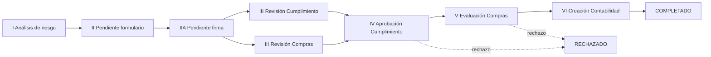
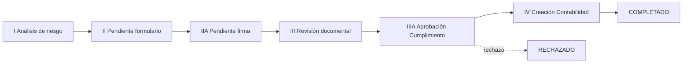

# Supplier and customer onboarding

Two workflows for registering third parties: **supplier onboarding** (`/suppliers/onboarding`) and **customer onboarding** (`/customers/onboarding`). Each one combines an internal, role-based approval board with a public form that the third party fills without an account, an electronic signature step, per-document compliance review, PDF/Excel reports and tracked email hand-offs.

All companies, contacts, NITs and compliance links in this repo are fictional. Branding for the public pages, PDFs and emails comes from `lib/empresas.ts` plus the optional extras in `lib/onboarding/branding.ts`.

## Where the code lives

| Area | Path |
| --- | --- |
| Convex functions | `convex/onboarding/` — `suppliers.ts`, `suppliersPublic.ts`, `suppliersTipos.ts`, `suppliersEvaluar.ts`, `suppliersReportes.ts`, `customers.ts`, `customersPublic.ts`, shared `roles.ts`, `tokens.ts`, `correos.ts`, `notificaciones.ts`, `schema.ts`, `validators.ts` |
| Convex helpers | `convex/lib/onboarding/` — access levels, phase helpers, tokens, tracked emails, document materialization, storage scoping |
| Shared domain libs (no React, no `process.env`) | `lib/onboarding/` — risk matrices, document sets, phase catalogs, declarations, roles, links, email types, business days |
| Internal boards | `app/(default)/suppliers/onboarding/`, `app/(default)/customers/onboarding/` |
| Public pages | `app/(public)/onboarding/supplier`, `.../supplier/sign`, `.../customer`, `.../customer/sign` |
| Email delivery | `lib/onboarding/email-service.tsx`, `lib/onboarding/email-route.ts`, `app/api/notifications/onboarding/{supplier,customer}/route.tsx`, `app/api/webhooks/resend/onboarding/route.ts`, `components/emails/onboarding/OnboardingEmail.tsx` |
| RUT extraction (optional) | `app/api/extract-rut/route.ts` |

## Phases

### Suppliers

- **Start.** A user with the route permission starts the process from the board: uploads the RUT (optionally prefilled by AI extraction), enters contact and risk-matrix data and picks the supplier type. The risk and evaluation type are computed server-side; Fase I is auto-completed and the tracked `FASE_I_COMPLETADA` invitation goes out. If the NIT already exists in the Nest supplier catalog (`/api/proveedores/search`) the request becomes an **ACTUALIZACIÓN**.
- **Fase II.** The supplier fills 11 sections with autosave, uploads every required document (by evaluation type, person type, PEP and supplier-type extras) and submits. The signature request (`PENDIENTE_FIRMA`) goes to the legal representative.
- **Fase IIA.** The legal representative reviews the PDF and signs. Signing materializes the document review rows and opens both Fase III lanes.
- **Fase III.** Cumplimiento and Compras review their documents in parallel; rejected documents are re-uploaded by the supplier (form link stays valid) or replaced by the responsable. Cumplimiento can raise PEP/listas, which recomputes the risk and adds missing documents. When both lanes are approved, Fase IV opens assigned to the Cumplimiento tier for the evaluation type.
- **Fase IV.** Cumplimiento approves (→ Fase V) or rejects with a supplier-facing and an internal motive.
- **Fase V.** Compras scores the supplier (`evaluarProveedor`) and confirms.
- **Fase VI.** Contabilidad confirms creation in the accounting system, optionally with notes and support files; the closing emails (supplier, Financiero with the phase-time PDF) are posted from the browser.

### Customers

- **Start.** The commercial responsable uploads the RUT, enters the customer, legal representative and risk data, sets the **payment terms** (`Anticipado` ⇔ plazo `NA`), optionally attaches a quotation and pre-loads documents, and picks INSCRIPCIÓN or ACTUALIZACIÓN manually.
- **Fase II / IIA.** Same as suppliers with 10 sections; payment terms are read-only for the customer. Submitting requires the legal representative email; the tax questionnaire has conditional rules enforced on submit (`assertInfoTributariaClienteParaEnvio`).
- **Fase III.** Single Cumplimiento lane. All approved → **Fase IIIA** assigned by evaluation tier (`APROBACION_CUMPLIMIENTO_ASIGNADA`).
- **Fase IIIA.** Approve (→ Fase IV) or reject with customer-facing and internal motives.
- **Fase IV.** Contabilidad confirms creation with optional closing notes; the browser posts the closing emails with the signed form PDF (customer, internal team) and the phase-time PDF (Financiero).

Both modules support **devolver fase** (return the process to an earlier phase: later rows are deleted, signature/reviews/rejections are unwound, links are revoked and the right invitation is re-sent) and **anular** (terminal `ANULADA`, all links revoked, kept for audit).

## Roles and access levels

Roles are configured per company and module in **Configuración** (admins only) and stored in `onboardingRoles`.

| Role | Suppliers | Customers |
| --- | --- | --- |
| `CUMPLIMIENTO_LOW_RISK` | Fase I, Fase III lane, Fase IV for SOLO LISTAS / SIMPLIFICADA | Fase I, Fase III, Fase IIIA for SOLO LISTAS / SIMPLIFICADA |
| `CUMPLIMIENTO_MEDIUM_RISK` | Fase IV for COMPLETA | Fase IIIA for COMPLETA |
| `CUMPLIMIENTO_HIGH_RISK` | Fase IV for INTENSIFICADA | Fase IIIA for INTENSIFICADA |
| `COMPRAS` | Fase III lane, Fase V | — |
| `CONTABILIDAD` | Fase VI | Fase IV |
| `FINANCIERO` | Receives the closing report | Receives the closing report |

Access level is derived on the server from the identity (`resolveOnboardingAccess`):

- **full** — admins or holders of any role in scope: every tab, exports, anular/devolver.
- **responsable** — route permission only: can start processes and sees only the inscriptions they started.
- **consulta_creacion** / **solo_lectura** — whitelist entries: list and detail (and start processes for the former), no phase actions.

Every phase mutation re-checks the actor with `requireActorEnFase` (admin, the assigned user, or the configured user for the role that owns the phase). Actor ids are never accepted from the client.

## Public links and tokens

Public pages are reached only through links of the form `/onboarding/<supplier|customer>[/sign]?id=<inscripcionId>&t=<token>`.

- Tokens are random 256-bit values; only their SHA-256 hash is stored (`onboardingAccessTokens`). Scopes: `FORM` (30 days) and `SIGN` (14 days); read-only viewer links used by staff last 2 hours.
- Resending an invitation rotates the token; signing consumes the `SIGN` token; anulación and devolución revoke tokens; expiry is materialized by a scheduled mutation.
- Before editing or uploading, the third party confirms the document type and number registered by the company; the same pair is sent with every public mutation and re-checked server-side.
- Public queries return a projection (no risk scores, no internal motives, no accounting notes) and `null` for invalid links so pages can show "enlace inválido".
- File URLs for the public pages are issued only for storage ids owned by that inscription.

## Emails

Delivery goes through `POST /api/notifications/onboarding/{supplier|customer}`:

- `kind: "tracked"` — hand-offs to the third party (`FASE_I_COMPLETADA`, `PENDIENTE_FIRMA`). Convex records an attempt (`onboardingCorreos`), mints the token, and calls the route with the internal key. Resend delivery events arrive through `POST /api/webhooks/resend/onboarding` (Svix-signed, deduplicated by `svix-id`) and update the attempt monotonically; the board shows the latest state per hand-off and lets staff resend or copy a fresh link.
- `kind: "untracked"` — everything else. Convex mutations schedule staff/third-party notices; the closing emails with PDF attachments are posted from the browser by a signed-in user (attachments only with a session, PDF only, ≤ 4 MB).

Without `RESEND_API_KEY` the routes answer `{ sent: false, reason: "resend_not_configured" }` and the UI shows a warning instead of failing.

## Reports and PDFs

- **Board exports** (Excel) of all or filtered inscriptions.
- **Procesos** — time per phase for finished processes, calendar or business days (Colombian holidays), 4-sheet Excel.
- **Matriz de riesgo** (suppliers) — paginated report by date range with an Excel export and a data dictionary sheet.
- **PDFs** — risk matrix, signed inscription form, Compras evaluation (suppliers) and the phase-time report attached to the Financiero closing email. Rendered in the browser with `@react-pdf/renderer`.

## Environment

| Variable | Where | Purpose |
| --- | --- | --- |
| `NOTIFICATIONS_INTERNAL_KEY` | Next + Convex | Convex → Next notification calls |
| `RESEND_API_KEY`, `RESEND_FROM_EMAIL` | Next | Email delivery (optional) |
| `RESEND_WEBHOOK_SECRET` | Next | Verifies Resend delivery webhooks |
| `OPENROUTER_API_KEY` | Next | Optional AI extraction of the RUT when starting a process; without it the modal falls back to manual entry |
| `FRONTEND_URL` | Convex | Base URL Convex uses to reach the notification route |
| `NEXT_PUBLIC_APP_URL` | Next | Base URL embedded in email links |

Permissions: `suppliers/onboarding` and `customers/onboarding` (seeded in `apps/backend/src/permisos-roles/rutas-catalogo.ts`). Public paths are allowed in `proxy.ts` (`/onboarding/*`, `/api/webhooks/*`).

## Tests

- `convex/onboardingSuppliers.test.ts`, `convex/onboardingCustomers.test.ts` — end-to-end flows with `convex-test` (authorization by role and tier, public tokens, document review, returns, annulment).
- `convex/onboardingFoundation.test.ts` — Web Crypto smoke, token issue/verify/rotate/revoke/expire, tracked-email lifecycle and webhook events; `convex/lib/onboarding/correos.test.ts` — delivery-state transitions.
- `lib/onboarding/**/*.test.ts` — risk matrices, document sets, Compras evaluation, business days, links, notification payload validation.
- `app/api/notifications/onboarding/supplier/route.test.ts`, `app/api/webhooks/resend/onboarding/route.test.ts` — route authorization and webhook handling.
