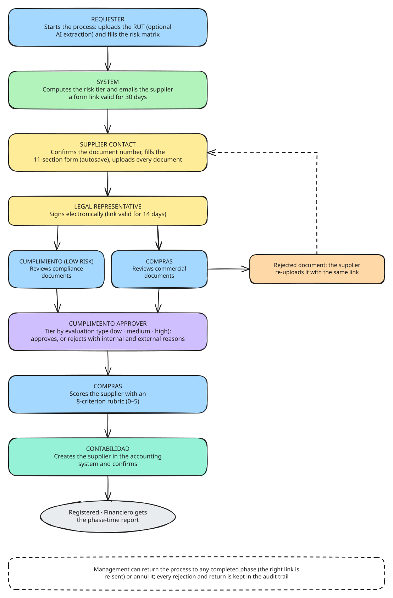
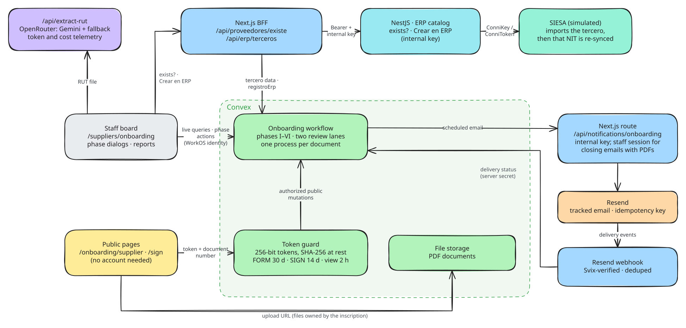

# Suppliers: onboarding with risk-based compliance review

Module guide for [Lab Trxckin](../README.md). All companies, NITs and emails in this repo are fictional demo data. The shared onboarding foundation (roles, access levels, tokens, emails) is described in [onboarding.md](onboarding.md).

<picture>
  <source media="(prefers-color-scheme: dark)" srcset="diagrams/suppliers-operational.dark.svg">
  
</picture>

## Context

Before a company can pay a new supplier, it has to know who it is dealing with: a risk assessment (amount, sector, jurisdiction, politically exposed persons, restrictive lists), a registration form with anti-money-laundering declarations, supporting documents that depend on that risk, the legal representative's signature, a compliance review, a purchasing evaluation and finally the supplier's creation in the accounting system.

Done by email, the documents arrive incomplete, nobody knows which version was signed, and every step waits on someone forwarding a thread. The suppliers module runs the whole registration as one tracked process, with a public form the supplier fills without an account.

## My role

I designed and built the module end to end as part of Lab Trxckin: the phase state machine and review lanes, the risk matrix, the public form with autosave and e-signature, the capability tokens, the tracked emails, the reports and the tests.

## Tech and why

| Choice | Why |
| --- | --- |
| **Convex** mutations as the transaction boundary | Signing, for example, stores the signature, closes the phase, creates the review rows, opens both review lanes, consumes the signing link and schedules the email atomically. |
| **Capability tokens** instead of supplier accounts | 256-bit random links, stored only as SHA-256 hashes, scoped to one inscription and purpose, with expiry. |
| **Shared pure libraries** (`lib/onboarding`) | The risk matrix, document sets, phase catalog and email types are imported by Convex, the Next.js routes and the browser, so each rule exists once. |
| **react-hook-form + zod** with debounced autosave | Long forms survive closed tabs; conditional tax rules are enforced at submission. |
| **Resend + Svix-verified webhooks** | Hand-off emails are tracked through delivery, with idempotency keys and monotonic status. |
| **OpenRouter** (optional) | Pre-fills the start form from the supplier's RUT; the UI falls back to manual entry without an API key. |
| **react-pdf, ExcelJS, SheetJS in the browser** | Forms, risk matrices and reports are generated client-side. |

## Results and learnings

- The supplier never needs an account: the link is the credential, and it expires (30 days to fill the form, 14 days to sign, 2 hours for staff read-only views).
- **Risk decides the path.** The evaluation type (*solo listas*, *simplificada*, *completa*, *intensificada*) decides which documents are required and which Cumplimiento tier approves.
- **Returns must unwind their side effects.** Sending a process back clears the signature, reviews and rejections that no longer apply, revokes old links and re-sends the right invitation, so the state never contradicts itself.
- **Track delivery only where it matters.** Hand-offs to the supplier are tracked through Resend webhooks; routine notices are fire-and-forget.

## How it works

1. **Requester:** starts the process on `/suppliers/onboarding`: uploads the RUT (optional AI extraction fills the fields, showing its token cost), then fills the contact and risk-matrix data. The risk and evaluation type are computed on the server. The document is checked against the company's ERP catalog (existing supplier → *actualización*) and against earlier processes: one still in progress blocks a new one, and previous ones open in a stacked detail view ([erp.md](erp.md)).
2. **System:** completes phase I and emails the supplier a form link valid for 30 days.
3. **Supplier contact:** confirms the registered document number, fills the **11-section form** with autosave, uploads every required document and submits.
4. **Legal representative:** receives a signing link (14 days), reviews the PDF and signs on screen.
5. **Cumplimiento (low risk) and Compras,** in parallel: each reviews its own documents. A rejected document is emailed to the supplier, who re-uploads it with the same link. Cumplimiento can also raise the PEP or restrictive-list answers, which recomputes the risk and adds documents.
6. **Cumplimiento approver:** the tier for the evaluation type (low, medium or high) approves, or rejects with an internal reason and a reason the supplier sees.
7. **Compras:** scores the supplier with an 8-criterion rubric (0–5: *aceptable*, *no aceptable* or *en reserva*) and confirms.
8. **Contabilidad:** creates the supplier in the accounting system ("Crear en ERP" registers it in the simulated ERP and re-syncs the catalog), optionally adds notes and files, and confirms. The supplier is emailed, and Financiero receives the phase-time report.

Management users can return the process to any completed phase or annul it; everything stays in the audit trail.

## Technical design

<picture>
  <source media="(prefers-color-scheme: dark)" srcset="diagrams/suppliers-technical.dark.svg">
  
</picture>

### Phases

| Phase | Owner | Leaves when |
| --- | --- | --- |
| I Análisis de riesgo | Requester (auto-completed) | The process is created |
| II Pendiente formulario | Supplier contact | The form is submitted with every required document |
| IIA Pendiente firma | Legal representative | The form is signed |
| III Revisión documental | Cumplimiento (low) **and** Compras lanes | Every document in both lanes is approved |
| IV Aprobación Cumplimiento | Tier approver by evaluation type | Approved (→ V) or rejected |
| V Evaluación Compras | Compras | Evaluation saved and confirmed, or rejected |
| VI Creación Contabilidad | Contabilidad | Creation confirmed → **Completado** |

Every phase action re-checks the actor on the server: an admin, the assigned user, or the user configured for the role that owns the phase.

### Risk matrix and documents

Six factors score 1–4 (amount, sector, national jurisdiction, international jurisdiction, PEP and restrictive lists) and the overall risk is the maximum:

| Score | Risk | Evaluation type |
| --- | --- | --- |
| 1 | Bajo | Solo listas |
| 2 | Medio | Simplificada |
| 3 | Alto | Completa |
| 4 | Superior | Intensificada |

The required documents depend on the evaluation type, the person type (natural or legal entity), PEP status and the supplier type's extras. Each document belongs to the Cumplimiento or the Compras lane.

### Public links

- Links look like `/onboarding/supplier?id=<inscripcionId>&t=<token>`. `FORM` tokens last 30 days and `SIGN` tokens 14 days; staff read-only links last 2 hours and are refused by every mutation.
- Resending an invitation or copying a new link from the board rotates the token; signing consumes the signing token; returns and annulment revoke tokens; expiry is enforced by a scheduled mutation.
- Autosave, submission, document re-upload, upload URLs and signing re-check the document type and number the supplier confirmed.
- The public layout sets `noindex` and `no-referrer`.

### Emails

Hand-offs to the supplier (form invitation, signing request) are **tracked**: Convex records an attempt, the Next.js route sends it through Resend with an idempotency key, and delivery webhooks (Svix-verified, deduplicated) move its status forward. The board shows the latest status per hand-off and lets staff resend. Other notices are untracked.

### AI RUT extraction

`/api/extract-rut` sends the RUT (PDF, JPEG or PNG up to 10 MB) to OpenRouter (`google/gemini-2.0-flash-001`, with a fallback model) and asks for 15 JSON fields. The response includes token usage and cost. Without `OPENROUTER_API_KEY` it returns 503 and the modal switches to manual entry.

### Compras rubric

Eight criteria (experience, references, portfolio, certificates, guarantees, technical sheets, payment terms, occupational safety / environmental), each worth up to 30 points; "does not apply" is excluded. Any applicable zero puts the supplier *en reserva*; otherwise a score above 3 out of 5 is *aceptable* and anything else *no aceptable*.

## Code map

**Convex**
- [`convex/onboarding/suppliers.ts`](<../apps/frontend/convex/onboarding/suppliers.ts>): internal state machine, boards, reports, returns and annulment
- [`convex/onboarding/suppliersPublic.ts`](<../apps/frontend/convex/onboarding/suppliersPublic.ts>): public form, submission, signing, re-uploads
- [`convex/onboarding/suppliersEvaluar.ts`](<../apps/frontend/convex/onboarding/suppliersEvaluar.ts>): Compras rubric
- [`convex/onboarding/suppliersTipos.ts`](<../apps/frontend/convex/onboarding/suppliersTipos.ts>): supplier types and extra documents
- [`convex/lib/onboarding/suppliersDocs.ts`](<../apps/frontend/convex/lib/onboarding/suppliersDocs.ts>): review lanes, document materialization, tax rules
- [`convex/lib/onboarding/tokens.ts`](<../apps/frontend/convex/lib/onboarding/tokens.ts>): token issue, hash, rotation, revocation and guard
- [`convex/onboarding/schema.ts`](<../apps/frontend/convex/onboarding/schema.ts>): every onboarding table

**Domain libraries**
- [`lib/onboarding/risk/`](<../apps/frontend/lib/onboarding/risk/>): risk matrices
- [`lib/onboarding/documents/suppliers.ts`](<../apps/frontend/lib/onboarding/documents/suppliers.ts>): required documents
- [`lib/onboarding/evaluacion-compras.ts`](<../apps/frontend/lib/onboarding/evaluacion-compras.ts>): rubric maths

**Pages and routes**
- [`suppliers/onboarding/`](<../apps/frontend/app/(default)/suppliers/onboarding/>): internal board, phase dialogs, reports, PDFs
- [`(public)/onboarding/supplier/`](<../apps/frontend/app/(public)/onboarding/supplier/>): public form and signing page
- [`api/extract-rut/route.ts`](<../apps/frontend/app/api/extract-rut/route.ts>): AI RUT extraction
- [`api/notifications/onboarding/supplier/route.tsx`](<../apps/frontend/app/api/notifications/onboarding/supplier/route.tsx>), [`api/webhooks/resend/onboarding/route.ts`](<../apps/frontend/app/api/webhooks/resend/onboarding/route.ts>): emails and delivery webhooks

## Tests

- [`onboardingSuppliers.test.ts`](<../apps/frontend/convex/onboardingSuppliers.test.ts>): the full flow, including company scope, the public gate, one-shot signing, both lanes, tiered approval, the rubric gate, returns and annulment
- [`onboardingFoundation.test.ts`](<../apps/frontend/convex/onboardingFoundation.test.ts>): hash-only token storage, rotation, revocation, expiry and the tracked-email lifecycle
- [`onboardingProcesosPorDocumento.test.ts`](<../apps/frontend/convex/onboardingProcesosPorDocumento.test.ts>): one process in progress per document, the existing-process alert (with redaction), the non-throwing stacked detail and the ERP registration
- [`lib/onboarding/risk/compute.test.ts`](<../apps/frontend/lib/onboarding/risk/compute.test.ts>), [`lib/onboarding/documents/documents.test.ts`](<../apps/frontend/lib/onboarding/documents/documents.test.ts>), [`lib/onboarding/evaluacion-compras.test.ts`](<../apps/frontend/lib/onboarding/evaluacion-compras.test.ts>): risk, documents and rubric
- [`supplier/route.test.ts`](<../apps/frontend/app/api/notifications/onboarding/supplier/route.test.ts>), [`webhooks/resend/onboarding/route.test.ts`](<../apps/frontend/app/api/webhooks/resend/onboarding/route.test.ts>): route authorization and webhook handling

## Known limitations

This is a portfolio extraction and hardening is ongoing. Server-side authorization for this module is described in the README's [security notes](../README.md#security-notes-and-known-limitations). Still open:

- Phase V can be confirmed with a *no aceptable* result (the score itself is recomputed on the server from the criteria).
- The document type and number the supplier confirms are part of the public projection, so re-checking them is not a strong second factor.
- Creating the supplier in the accounting system is still a manual confirmation; "Crear en ERP" writes to the simulated ERP only (see [erp.md](erp.md) to go live).
- Signed forms are re-rendered from current data on each download rather than archived.
- Closing emails are sent from the browser after the final confirmation; if the tab closes first, they are not sent.
- Each role has one user per company, and boards load up to 2,000 rows and filter in the browser.
